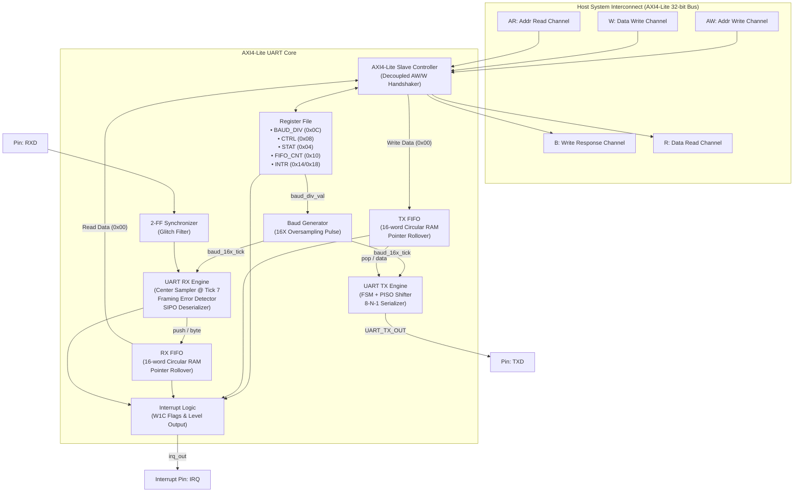

# AXI4-Lite UART Peripheral & FIFO Buffer — Master MOC

Welcome to the central knowledge repository for the **AXI4-Lite UART Peripheral & FIFO Buffer** project. This project implements an industry-standard, synthesizable serial communication controller in **SystemVerilog**, bridged to an **AMBA AXI4-Lite** system bus with decoupled asynchronous 16-element circular FIFOs, 16X oversampling center-sampled receiver, and a high-coverage verification environment.

---

## Vault Map of Content (Navigation)

```
00 - Index & Overview/
├── [[00_MOC_Project_Overview|Master Project MOC]]
└── [[01_Resume_Specification_Traceability|Resume Specification & Traceability Matrix]]

01 - AMBA AXI4-Lite Protocol/
├── [[01_AXI4_Lite_Protocol_Fundamentals|AXI4-Lite Protocol Fundamentals & Handshake Rules]]
├── [[02_AXI4_Lite_Slave_Interface_Architecture|AXI4-Lite Slave Interface FSM & Phase Handling]]
└── [[03_Register_Map_Specification|Complete Register Map & Bitfield Definitions]]

02 - Baud Rate & Clocking/
├── [[01_Baud_Rate_Generator_&_16X_Oversampling_Math|Baud Rate Math, Oversampling & Tolerance Analysis]]
└── [[02_Clock_Domain_&_Metastability_CDC|Clock Domain Crossing (CDC) & 2-FF Synchronizer Design]]

03 - UART Transmitter (TX)/
├── [[01_UART_TX_Architecture_&_FSM|UART TX Architecture, State Machine & Shift Register]]
└── [[02_TX_Timing_&_Handshaking|TX Timing Diagrams & FIFO Interface]]

04 - UART Receiver (RX)/
├── [[01_UART_RX_Architecture_&_FSM|UART RX Architecture, State Machine & Glitch Filter]]
├── [[02_Center_Sampling_&_Majority_Voting|Center-Sampling Methodology & Noise Rejection]]
└── [[03_Error_Detection_&_Recovery|Framing Error Detection, Overrun Handling & Resynchronization]]

05 - Circular FIFO Buffer/
├── [[01_Circular_FIFO_Pointer_Rollover_Theory|Pointer Rollover Method (Math & MSB Inversion)]]
└── [[02_FIFO_Hardware_Implementation_&_Flags|FIFO RTL Implementation, Full/Empty/Watermark Generation]]

06 - Top-Level Integration & Interrupts/
├── [[01_UART_Top_Level_Interconnect|Top-Level Interconnect & Signal Routing]]
└── [[02_Interrupt_Architecture_&_Status_Reporting|Interrupt Controller, W1C Logic & Status Reporting]]

07 - Verification & Testbench/
├── [[01_Verification_Plan_&_Coverage_Goals|Verification Strategy, Test Scenarios & Coverage Matrix]]
├── [[02_AXI4_Lite_Master_BFM_&_Test_Scenarios|AXI4-Lite Master BFM & Randomized Latency Generation]]
├── [[03_Loopback_Testing_&_Framing_Error_Injection|Loopback Testbench, Error Injection & Recovery Validation]]
└── [[04_ModelSim_Simulation_&_DO_Scripts|ModelSim Batch Scripts, Waveforms & Automation]]

08 - Interview Prep & Deep-Dive/
├── [[01_Resume_Deep_Dive_&_Interview_Questions|25+ Deep Technical Interview Questions & Answers]]
└── [[02_Design_Tradeoffs_&_Alternative_Architectures|Architectural Tradeoffs (16x vs 8x, FIFO Pointers vs Counters)]]
```

---

## Top-Level System Architecture



---

## Key System Parameters

| Parameter | Specification | Hardware Details |
| :--- | :--- | :--- |
| **Bus Interface** | AMBA AXI4-Lite Slave | 32-bit Data, 32-bit Address, Single-cycle Handshake |
| **System Clock ($f_{\text{clk}}$)** | 100 MHz (Nominal) / 50 MHz | Synthesizable on FPGA (Artix-7 / Cyclone V / UltraScale) |
| **Default Baud Rate** | 115,200 bps | Configurable from 9,600 to 921,600 bps via 16-bit Divisor |
| **Oversampling Factor** | **16X** | Generates 16 ticks per serial bit time ($T_{\text{bit}}$) |
| **Bit Framing** | **8-N-1** | 1 Start bit (0), 8 Data bits (LSB first), No parity, 1 Stop bit (1) |
| **RX Center Sampling** | Tick 7 ($T_{\text{bit}}/2$) | Rejects transition noise, jitter, and suppresses false start bits |
| **FIFO Architecture** | Dual 16-element Circular | Independent TX & RX; Depth = 16, Width = 8; Pointer Rollover |
| **CDC Protection** | 2-Stage Flip-Flop Synchronizer | Resolves metastability on external asynchronous `RX` pin |
| **Error Handling** | Framing & Overrun Detection | Status bit assertion, interrupt generation, safe state recovery |
| **Loopback Mode** | Digital Internal Loopback | Diagnostic mode connecting TX serializer output directly to RX CDC |

---

## Verification Highlights
- **AXI4-Lite Master BFM**: Randomized cycle delays between `AWVALID`, `WVALID`, `BREADY`, `ARVALID`, `RREADY`.
- **Corner Case Validation**: Full FIFO backpressure, empty FIFO underflow read, simultaneous read and write.
- **Framing Error Injection**: Intentional stop bit corruption with recovery on subsequent frames.
- **ModelSim Toolflow**: Fully scriptable execution using TCL/DO scripts (`run_sim.do`) with automated self-checking scoreboards.
