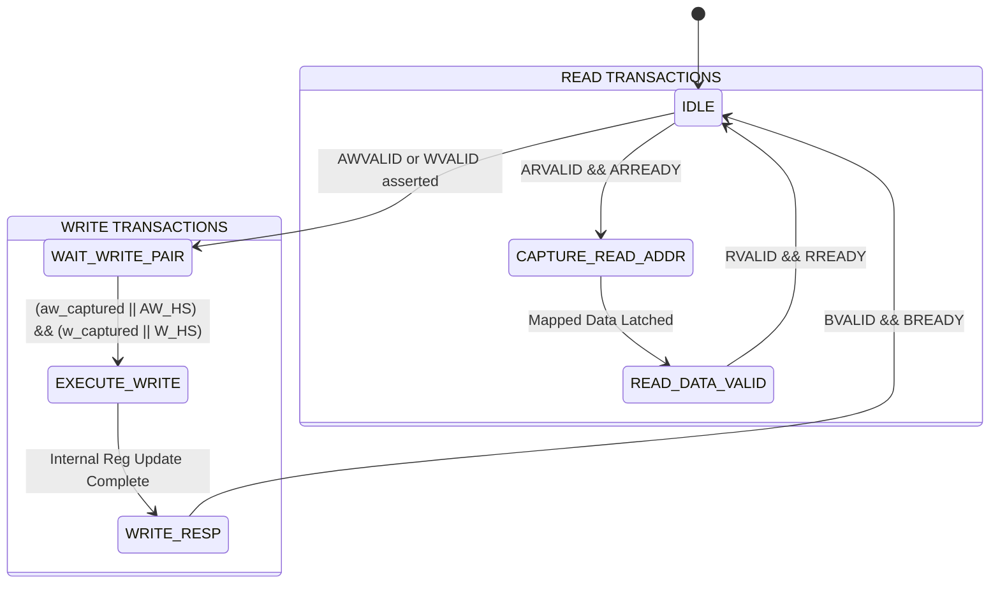

# AXI4-Lite Slave Interface Architecture & FSM Design

This note presents the hardware architecture, register slicing, and finite state machine (FSM) implementation of our synthesizable **AXI4-Lite Slave Controller**.

---

## 1. Architectural Strategy: Decoupled Latching

To achieve full compliance with AMBA specifications and maximize interconnect timing closure, our slave controller utilizes decoupled address and data capturing registers.

### Internal Capturing Registers
- `awaddr_reg [31:0]`: Latches `s_axi_awaddr` when `AWVALID && AWREADY`.
- `wdata_reg [31:0]`: Latches `s_axi_wdata` when `WVALID && WREADY`.
- `wstrb_reg [3:0]`: Latches `s_axi_wstrb` when `WVALID && WREADY`.
- Flags:
  - `aw_captured`: Set HIGH when write address handshake completes; cleared when write executes.
  - `w_captured`: Set HIGH when write data handshake completes; cleared when write executes.



---

## 2. Write Transaction FSM Details

### State 1: `WR_IDLE / WR_WAIT_DATA`
- `s_axi_awready` and `s_axi_wready` are driven HIGH to accept incoming transfers without introducing artificial latency cycles.
- When `s_axi_awvalid && s_axi_awready`: `awaddr_reg <= s_axi_awaddr`, `aw_captured <= 1'b1`.
- When `s_axi_wvalid && s_axi_wready`: `wdata_reg <= s_axi_wdata`, `wstrb_reg <= s_axi_wstrb`, `w_captured <= 1'b1`.
- Once both flags (`aw_captured` and `w_captured`) are satisfied:
  - Trigger write strobe to internal register file or FIFO push logic.
  - Assert `s_axi_bvalid <= 1'b1`.
  - Calculate `s_axi_bresp` (`OKAY` if address is valid, `SLVERR` if out-of-bounds).

### State 2: `WR_RESP`
- Keep `s_axi_bvalid` asserted until `s_axi_bready` is detected on rising clock edge.
- Once `s_axi_bvalid && s_axi_bready`:
  - De-assert `s_axi_bvalid`.
  - Clear `aw_captured` and `w_captured`.
  - Return to receptive state.

---

## 3. Read Transaction FSM Details

Reads are inherently simpler because AXI4-Lite specifies a single address phase followed by a data phase.

### State 1: `RD_IDLE`
- `s_axi_arready <= 1'b1`.
- When `s_axi_arvalid && s_axi_arready`:
  - Latch `araddr_reg <= s_axi_araddr`.
  - De-assert `s_axi_arready` to prevent overrun while processing.
  - Perform register address decoding combinational lookup.
  - Latch read data into `s_axi_rdata`.
  - If address is `0x00` (DATA_REG), generate a 1-cycle `rx_fifo_pop` strobe.
  - Assert `s_axi_rvalid <= 1'b1`.
  - Set `s_axi_rresp <= 2'b00` (OKAY) or `2'b10` (SLVERR).

### State 2: `RD_DATA`
- Hold `s_axi_rvalid` and `s_axi_rdata` stable.
- When `s_axi_rvalid && s_axi_rready`:
  - Transaction finishes.
  - De-assert `s_axi_rvalid`.
  - Re-assert `s_axi_arready <= 1'b1`.

---

## 4. SystemVerilog Interface Declaration

```systemverilog
interface axi4_lite_if #(
    parameter int ADDR_WIDTH = 32,
    parameter int DATA_WIDTH = 32
)(
    input logic aclk,
    input logic aresetn
);
    // Write Address Channel
    logic [ADDR_WIDTH-1:0] awaddr;
    logic [2:0]            awprot;
    logic                  awvalid;
    logic                  awready;

    // Write Data Channel
    logic [DATA_WIDTH-1:0] wdata;
    logic [(DATA_WIDTH/8)-1:0] wstrb;
    logic                  wvalid;
    logic                  wready;

    // Write Response Channel
    logic [1:0]            bresp;
    logic                  bvalid;
    logic                  bready;

    // Read Address Channel
    logic [ADDR_WIDTH-1:0] araddr;
    logic [2:0]            arprot;
    logic                  arvalid;
    logic                  arready;

    // Read Data Channel
    logic [DATA_WIDTH-1:0] rdata;
    logic [1:0]            rresp;
    logic                  rvalid;
    logic                  rready;

    // Master Modport
    modport master (
        input  aclk, aresetn, awready, wready, bresp, bvalid, arready, rdata, rresp, rvalid,
        output awaddr, awprot, awvalid, wdata, wstrb, wvalid, bready, araddr, arprot, arvalid, rready
    );

    // Slave Modport
    modport slave (
        input  aclk, aresetn, awaddr, awprot, awvalid, wdata, wstrb, wvalid, bready, araddr, arprot, arvalid, rready,
        output awready, wready, bresp, bvalid, arready, rdata, rresp, rvalid
    );
endinterface
```

---

## 5. Byte Strobe (`WSTRB`) Handling

AXI4-Lite provides 4 write strobes (`WSTRB[3:0]`), where each bit corresponds to 8 bits of `WDATA[31:0]`:
- `WSTRB[0]` $\to$ `WDATA[7:0]`
- `WSTRB[1]` $\to$ `WDATA[15:8]`
- `WSTRB[2]` $\to$ `WDATA[23:16]`
- `WSTRB[3]` $\to$ `WDATA[31:24]`

For 32-bit registers (like `UART_BAUD_DIV` or `UART_CTRL`), individual byte strobes allow writing individual bytes without corrupting other fields:
```systemverilog
for (int byte_idx = 0; byte_idx < 4; byte_idx++) begin
    if (wstrb_reg[byte_idx]) begin
        ctrl_reg[byte_idx*8 +: 8] <= wdata_reg[byte_idx*8 +: 8];
    end
end
```
For `UART_DATA` (`0x00`), only `WSTRB[0]` is evaluated because the UART serial engine is an 8-bit transmitter.

[[03_Register_Map_Specification|Next: Complete Register Map & Bitfield Definitions ->]]
