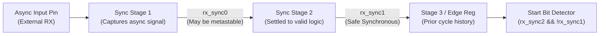

# Clock Domain Crossing (CDC) & Metastability

The serial `rx` line enters the chip from an external, completely asynchronous source (e.g. an FTDI USB-to-UART chip, a microcontroller, or an external cable). Feeding an asynchronous input directly into peripheral sequential logic violates setup ($t_{\text{su}}$) and hold ($t_h$) times, triggering **metastability**.

---

## 1. The Physics of Metastability

When an asynchronous transition occurs inside the forbidden timing window of a flip-flop:
1. The internal bistable feedback circuit fails to resolve cleanly to logic `0` or logic `1`.
2. The output voltage hovers near the midpoint threshold $V_{DD}/2$.
3. Downstream combinational gates may interpret the indeterminate voltage differently, causing catastrophic logic corruption and system lockup.

```
                  +--- Clock Window ---+
                  |  t_setup | t_hold  |
       CLK    ____/‾‾‾‾‾‾‾‾‾‾\_________
       DATA   ______/‾‾\_______________  <-- Transition inside window!
                     |                 |
       Q_OUT  _______/~~~~~~~~~~~~~~~~~\______  <-- Metastable oscillation!
```

---

## 2. Quantitative MTBF Analysis

The **Mean Time Between Failures (MTBF)** of a synchronizer circuit is modeled mathematically by:

$$\text{MTBF} = \frac{e^{\frac{t_{\text{resolve}}}{\tau}}}{T_0 \times f_{\text{clk}} \times f_{\text{data}}}$$

Where:
- $f_{\text{clk}}$ = Synchronizing clock frequency ($100\text{ MHz}$).
- $f_{\text{data}}$ = Data transition rate (maximum toggle rate $\approx 115.2\text{ kHz}$).
- $T_0, \tau$ = Technology-dependent transistor parameters (for modern 28nm/16nm FPGAs, $\tau \approx 20\text{ ps}$).
- $t_{\text{resolve}}$ = Time available for the metastable state to settle:
  $$t_{\text{resolve}} = T_{\text{clk}} - t_{\text{comb\_delay}} - t_{\text{setup}}$$

For a 2-stage synchronizer at $100\text{ MHz}$ ($T_{\text{clk}} = 10\text{ ns}$):
$$t_{\text{resolve}} \approx 10\text{ ns} - 0.5\text{ ns} = 9.5\text{ ns}$$
$$\frac{t_{\text{resolve}}}{\tau} = \frac{9.5\text{ ns}}{20\text{ ps}} = 475$$
$$e^{475} \to \infty$$

A 2-stage synchronizer yields an MTBF exceeding **millions of years**, effectively reducing the probability of metastability failure to zero!

---

## 3. Two-Stage Flip-Flop Synchronizer Implementation



### Synthesis Attributes: Keeping Flip-Flops in the Same Slice
To ensure the routing delay between the two synchronizer flip-flops is minimal (maximizing $t_{\text{resolve}}$), we use vendor-specific synthesis attributes:

```systemverilog
module uart_rx_cdc (
    input  logic clk,
    input  logic rst_n,
    input  logic async_rx,
    output logic sync_rx,
    output logic rx_fall_edge
);
    // Xilinx / Intel synthesis attributes to prevent register absorption/re-timing
    (* ASYNC_REG = "TRUE" *) logic rx_stage1;
    (* ASYNC_REG = "TRUE" *) logic rx_stage2;
    logic rx_stage3; // Used for edge detection

    always_ff @(posedge clk or negedge rst_n) begin
        if (!rst_n) begin
            rx_stage1   <= 1'b1; // UART idle is mark (logic 1)
            rx_stage2   <= 1'b1;
            rx_stage3   <= 1'b1;
        end else begin
            rx_stage1   <= async_rx;
            rx_stage2   <= rx_stage1;
            rx_stage3   <= rx_stage2;
        end
    end

    assign sync_rx = rx_stage2;
    // Falling edge: previous cycle was 1, current cycle is 0
    assign rx_fall_edge = (rx_stage3 == 1'b1) && (rx_stage2 == 1'b0);

endmodule
```

---

## 4. Hardware Glitch Filtering

Even after CDC synchronization, electrical line noise (e.g. inductive coupling or relay switching) can generate narrow low spikes on an idle line.

If an unshielded UART receiver treated every falling edge as a valid start bit, the receiver would trigger, sample garbage data, and assert a framing error.
In our design, **start-bit validation at oversampling tick 7** provides active glitch suppression:
- When falling edge is detected, enter `START_CHECK` state.
- Count 7 oversampling ticks ($T_{\text{bit}}/2$).
- Verify `sync_rx == 0`.
- If `sync_rx == 1`, the pulse was a transient glitch ($< T_{\text{bit}}/2$ duration). The receiver immediately returns to `IDLE` without raising any false alarms or polluting the RX FIFO!

[[01_UART_TX_Architecture_&_FSM|Next: UART Transmitter (TX) Architecture & FSM ->]]
