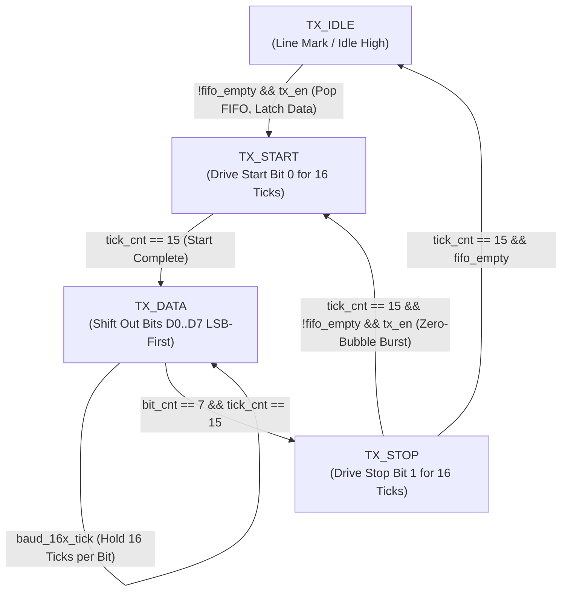

# UART Transmitter (TX) Architecture & FSM

The UART Transmitter is a synthesizable hardware engine responsible for serializing 8-bit parallel data from the TX FIFO into an industry-standard **8-N-1** asynchronous serial stream.

---

## 1. Frame Structure (8-N-1)

Each frame transmitted on the `TX` pin consists of 10 discrete bit periods:
1. **Idle Line**: Continuously held at logic `1` (Mark).
2. **Start Bit**: Driven to logic `0` (Space) for exactly 1 bit duration ($16 \times T_{\text{sample}}$).
3. **Data Bits (8 bits)**: Transmitted **LSB first** (`D0` through `D7`), each held for 16 oversampling ticks.
4. **Parity Bit**: Omitted in 8-N-1 configuration (optional parity expansion noted in design tradeoffs).
5. **Stop Bit**: Driven to logic `1` (Mark) for at least 1 bit duration (16 oversampling ticks).

```
       Line Idle                                                   Next Frame
       (Mark)     Start   D0    D1    D2    D3    D4    D5    D6    D7   Stop   (or Idle)
       ---1---+         +-----+-----+-----+-----+-----+-----+-----+-----+-----+
              |    0    | LSB |  .  |  .  |  .  |  .  |  .  |  .  | MSB |  1  |---1---
              +---------+-----+-----+-----+-----+-----+-----+-----+-----+-----+
```

---

## 2. Finite State Machine (FSM) Design

The TX engine operates on a clean 4-state Moore/Mealy hybrid FSM clocked by the system clock and gated by `baud_16x_tick`.



### State Explanations

1. **`TX_IDLE`**:
   - Output `tx_out = 1'b1`.
   - `tx_busy = 1'b0`.
   - Wait condition: When `!fifo_empty && tx_en`, assert `fifo_pop` strobe, capture `fifo_data[7:0]` into `tx_shift_reg`, and transition immediately to `TX_START`.

2. **`TX_START`**:
   - Output `tx_out = 1'b0` (Drive start bit).
   - `tx_busy = 1'b1`.
   - Oversampling counter `tick_cnt` increments on every `baud_16x_tick`.
   - When `tick_cnt == 15`, reset `tick_cnt <= 0`, initialize `bit_cnt <= 0`, and transition to `TX_DATA`.

3. **`TX_DATA`**:
   - Output `tx_out = tx_shift_reg[0]` (Drive current LSB).
   - On each `baud_16x_tick`, increment `tick_cnt`.
   - When `tick_cnt == 15`:
     - Shift right: `tx_shift_reg <= {1'b0, tx_shift_reg[7:1]}`.
     - Increment `bit_cnt <= bit_cnt + 1`.
     - Reset `tick_cnt <= 0`.
     - If `bit_cnt == 7`, transition to `TX_STOP`.

4. **`TX_STOP`**:
   - Output `tx_out = 1'b1` (Drive stop bit).
   - Hold for 16 ticks (`tick_cnt == 15`).
   - If `!fifo_empty && tx_en` on tick 15: Pop next byte, load shift register, clear `bit_cnt`, and transition directly to `TX_START` (**Zero inter-byte bubble latency** for maximum transmission throughput). Clearing `bit_cnt` here is mandatory: this path bypasses `TX_IDLE`, which is the only other state that re-arms the counter, so leaving it at 7 would end `TX_DATA` after a single data bit.
   - Otherwise, assert `tx_done_pulse` and transition to `TX_IDLE`.

---

## 3. Synthesizable SystemVerilog RTL Implementation

```systemverilog
module uart_tx (
    input  logic       clk,
    input  logic       rst_n,
    input  logic       baud_16x_tick,
    input  logic       tx_en,
    // FIFO Interface
    input  logic [7:0] tx_data,
    input  logic       tx_empty,
    output logic       tx_pop,
    // Serial Output & Status
    output logic       tx_out,
    output logic       tx_busy,
    output logic       tx_done
);
    typedef enum logic [1:0] {
        ST_IDLE  = 2'b00,
        ST_START = 2'b01,
        ST_DATA  = 2'b10,
        ST_STOP  = 2'b11
    } tx_state_t;

    tx_state_t  state_reg, state_next;
    logic [7:0] shift_reg;
    logic [3:0] tick_cnt;
    logic [2:0] bit_cnt;

    // Sequential State & Counter Updates
    always_ff @(posedge clk or negedge rst_n) begin
        if (!rst_n) begin
            state_reg <= ST_IDLE;
            shift_reg <= '0;
            tick_cnt  <= '0;
            bit_cnt   <= '0;
            tx_out    <= 1'b1;
            tx_busy   <= 1'b0;
            tx_done   <= 1'b0;
            tx_pop    <= 1'b0;
        end else begin
            tx_done <= 1'b0;
            tx_pop  <= 1'b0;

            case (state_reg)
                ST_IDLE: begin
                    tx_out  <= 1'b1;
                    tx_busy <= 1'b0;
                    tick_cnt<= '0;
                    bit_cnt <= '0;
                    if (!tx_empty && tx_en) begin
                        shift_reg <= tx_data;
                        tx_pop    <= 1'b1;     // Pop byte from FIFO
                        tx_busy   <= 1'b1;
                        state_reg <= ST_START;
                    end
                end

                ST_START: begin
                    tx_out  <= 1'b0; // Start bit
                    tx_busy <= 1'b1;
                    if (baud_16x_tick) begin
                        if (tick_cnt == 4'd15) begin
                            tick_cnt  <= '0;
                            state_reg <= ST_DATA;
                        end else begin
                            tick_cnt <= tick_cnt + 1'b1;
                        end
                    end
                end

                ST_DATA: begin
                    tx_out  <= shift_reg[0]; // Output current bit
                    tx_busy <= 1'b1;
                    if (baud_16x_tick) begin
                        if (tick_cnt == 4'd15) begin
                            tick_cnt  <= '0;
                            shift_reg <= {1'b0, shift_reg[7:1]};
                            if (bit_cnt == 3'd7) begin
                                state_reg <= ST_STOP;
                            end else begin
                                bit_cnt <= bit_cnt + 1'b1;
                            end
                        end else begin
                            tick_cnt <= tick_cnt + 1'b1;
                        end
                    end
                end

                ST_STOP: begin
                    tx_out  <= 1'b1; // Stop bit
                    tx_busy <= 1'b1;
                    if (baud_16x_tick) begin
                        if (tick_cnt == 4'd15) begin
                            tick_cnt <= '0;
                            tx_done  <= 1'b1;
                            if (!tx_empty && tx_en) begin
                                shift_reg <= tx_data;
                                tx_pop    <= 1'b1;
                                bit_cnt   <= '0; // ST_IDLE is bypassed, re-arm here
                                state_reg <= ST_START;
                            end else begin
                                state_reg <= ST_IDLE;
                            end
                        end else begin
                            tick_cnt <= tick_cnt + 1'b1;
                        end
                    end
                end
            endcase
        end
    end
endmodule
```

[[02_TX_Timing_&_Handshaking|Next: TX Timing Diagrams & Handshaking ->]]
