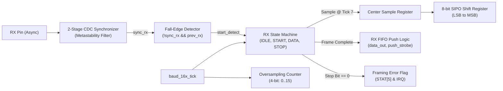
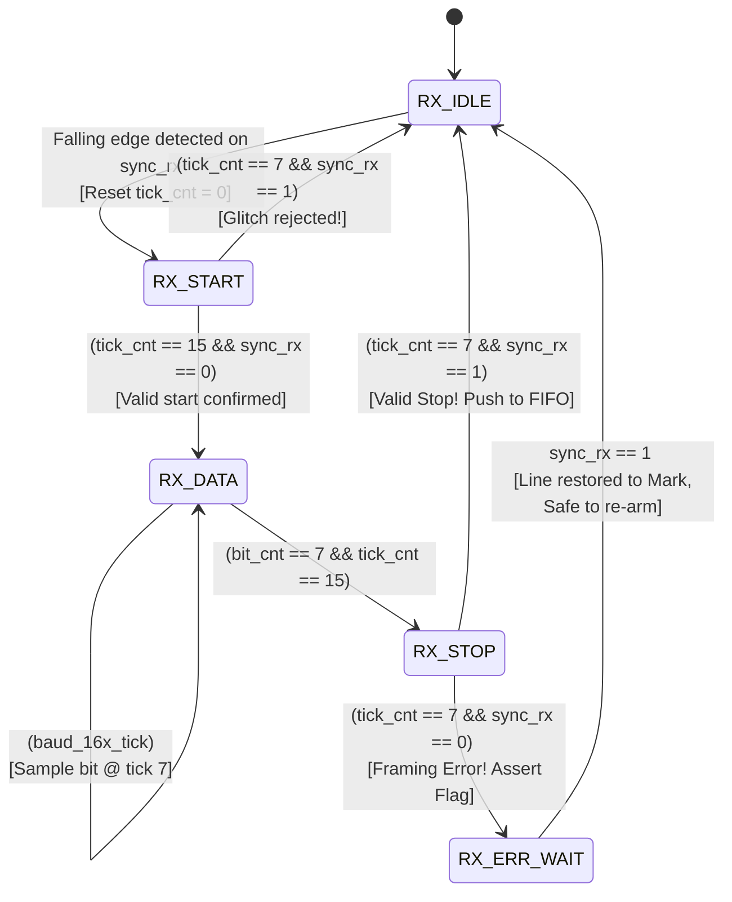

# UART Receiver (RX) Architecture & FSM

The UART Receiver is a robust, synthesizable deserializing engine designed to safely capture asynchronous serial data, suppress spurious line noise, sample bits at the ideal midpoint of the eye diagram, detect framing violations, and push valid received bytes into the RX FIFO.

---

## 1. Receiver Block Diagram



---

## 2. Receiver Finite State Machine (FSM)



### State Specifications

1. **`RX_IDLE`**:
   - Receiver monitors `sync_rx`.
   - When a falling edge is detected (`prev_rx == 1 && sync_rx == 0`) and `rx_en == 1`:
     - Initialize `tick_cnt <= 0`.
     - Transition to `RX_START`.

2. **`RX_START` (Glitch Filter Phase)**:
   - Oversampling counter `tick_cnt` increments on each `baud_16x_tick`.
   - **Glitch Check at Tick 7**: Halfway through the start bit window ($T_{\text{bit}}/2$), `sync_rx` is sampled.
     - If `sync_rx == 1`: The transition was an electrical noise glitch ($< T_{\text{bit}}/2$ duration). Abort and return to `RX_IDLE`.
     - If `sync_rx == 0`: Valid start bit confirmed.
   - When `tick_cnt == 15`: Reset `tick_cnt <= 0`, initialize `bit_cnt <= 0`, transition to `RX_DATA`.

3. **`RX_DATA` (Bit Deserialization Phase)**:
   - Counts 16 oversampling ticks per bit.
   - **Center Sample at Tick 7**: Sample `sync_rx` directly into the MSB of the shift register:
     $$\text{shift\_reg} \le \{\text{sync\_rx}, \text{shift\_reg}[7:1]\}$$
   - When `tick_cnt == 15`:
     - Increment `bit_cnt <= bit_cnt + 1`.
     - Reset `tick_cnt <= 0`.
     - If `bit_cnt == 7`: Transition to `RX_STOP`.

4. **`RX_STOP` (Framing Verification Phase)**:
   - Count up to tick 7 (center of the stop bit).
   - Sample `sync_rx`:
     - **If `sync_rx == 1` (Valid Stop Bit)**:
       - Assert `rx_data_out <= shift_reg`.
       - Assert `rx_push_strobe <= 1'b1` (if RX FIFO is not full).
       - When tick 15 completes, transition back to `RX_IDLE`.
     - **If `sync_rx == 0` (Framing Error)**:
       - Assert `framing_err <= 1'b1`.
       - Drop byte or tag as corrupted.
       - Transition to `RX_ERR_WAIT` to prevent false start bit cascading.

5. **`RX_ERR_WAIT` (Error Recovery State)**:
   - Waits until the serial line returns to the idle Mark state (`sync_rx == 1`).
   - Once `sync_rx == 1`, transitions cleanly back to `RX_IDLE`.

---

## 3. Synthesizable SystemVerilog Module (`uart_rx.sv`)

```systemverilog
module uart_rx (
    input  logic       clk,
    input  logic       rst_n,
    input  logic       baud_16x_tick,
    input  logic       rx_en,
    input  logic       rx_async_in,
    // FIFO Interface
    output logic [7:0] rx_data,
    output logic       rx_push,
    input  logic       rx_fifo_full,
    // Status & Error
    output logic       rx_busy,
    output logic       framing_err,
    output logic       overrun_err
);
    typedef enum logic [2:0] {
        ST_IDLE     = 3'b000,
        ST_START    = 3'b001,
        ST_DATA     = 3'b010,
        ST_STOP     = 3'b011,
        ST_ERR_WAIT = 3'b100
    } rx_state_t;

    rx_state_t state_reg;
    logic [7:0] shift_reg;
    logic [3:0] tick_cnt;
    logic [2:0] bit_cnt;

    // 2-FF CDC Synchronizer + Previous stage for edge detection
    (* ASYNC_REG = "TRUE" *) logic rx_sync0, rx_sync1;
    logic rx_prev;

    always_ff @(posedge clk or negedge rst_n) begin
        if (!rst_n) begin
            rx_sync0 <= 1'b1;
            rx_sync1 <= 1'b1;
            rx_prev  <= 1'b1;
        end else begin
            rx_sync0 <= rx_async_in;
            rx_sync1 <= rx_sync0;
            rx_prev  <= rx_sync1;
        end
    end

    wire fall_edge = (rx_prev == 1'b1) && (rx_sync1 == 1'b0);

    // Main FSM
    always_ff @(posedge clk or negedge rst_n) begin
        if (!rst_n) begin
            state_reg   <= ST_IDLE;
            shift_reg   <= '0;
            tick_cnt    <= '0;
            bit_cnt     <= '0;
            rx_data     <= '0;
            rx_push     <= 1'b0;
            rx_busy     <= 1'b0;
            framing_err <= 1'b0;
            overrun_err <= 1'b0;
        end else begin
            rx_push <= 1'b0; // Default single-cycle strobe

            case (state_reg)
                ST_IDLE: begin
                    rx_busy  <= 1'b0;
                    tick_cnt <= '0;
                    bit_cnt  <= '0;
                    if (fall_edge && rx_en) begin
                        rx_busy   <= 1'b1;
                        state_reg <= ST_START;
                    end
                end

                ST_START: begin
                    rx_busy <= 1'b1;
                    if (baud_16x_tick) begin
                        if (tick_cnt == 4'd7) begin
                            // Glitch check: line must be 0 at center of start bit
                            if (rx_sync1 != 1'b0) begin
                                state_reg <= ST_IDLE; // False start / glitch
                            end else begin
                                tick_cnt <= tick_cnt + 1'b1;
                            end
                        end else if (tick_cnt == 4'd15) begin
                            tick_cnt  <= '0;
                            bit_cnt   <= '0;
                            state_reg <= ST_DATA;
                        end else begin
                            tick_cnt <= tick_cnt + 1'b1;
                        end
                    end
                end

                ST_DATA: begin
                    rx_busy <= 1'b1;
                    if (baud_16x_tick) begin
                        if (tick_cnt == 4'd7) begin
                            // Center sample data bit
                            shift_reg <= {rx_sync1, shift_reg[7:1]};
                            tick_cnt  <= tick_cnt + 1'b1;
                        end else if (tick_cnt == 4'd15) begin
                            tick_cnt <= '0;
                            if (bit_cnt == 3'd7) begin
                                state_reg <= ST_STOP;
                            end else begin
                                bit_cnt <= bit_cnt + 1'b1;
                            end
                        end else begin
                            tick_cnt <= tick_cnt + 1'b1;
                        end
                    end
                end

                ST_STOP: begin
                    rx_busy <= 1'b1;
                    if (baud_16x_tick) begin
                        if (tick_cnt == 4'd7) begin
                            // Check stop bit at center
                            if (rx_sync1 == 1'b1) begin
                                // Valid Stop Bit
                                if (!rx_fifo_full) begin
                                    rx_data <= shift_reg;
                                    rx_push <= 1'b1;
                                end else begin
                                    overrun_err <= 1'b1;
                                end
                                tick_cnt <= tick_cnt + 1'b1;
                            end else begin
                                // Framing Error
                                framing_err <= 1'b1;
                                state_reg   <= ST_ERR_WAIT;
                            end
                        end else if (tick_cnt == 4'd15) begin
                            tick_cnt  <= '0;
                            state_reg <= ST_IDLE;
                        end else begin
                            tick_cnt <= tick_cnt + 1'b1;
                        end
                    end
                end

                ST_ERR_WAIT: begin
                    rx_busy <= 1'b1;
                    // Wait for line to return high before re-arming
                    if (rx_sync1 == 1'b1) begin
                        state_reg <= ST_IDLE;
                    end
                end
            endcase
        end
    end
endmodule
```

[[02_Center_Sampling_&_Majority_Voting|Next: Center Sampling & Majority Voting ->]]
