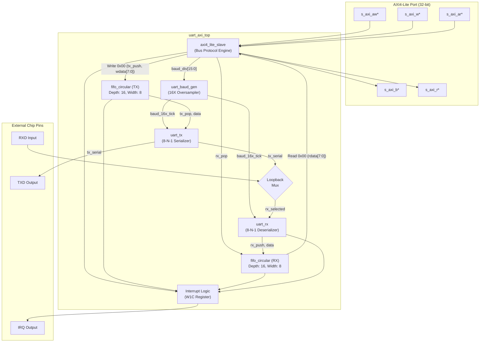

# UART Top-Level Interconnect

The top-level module `uart_axi_top.sv` integrates the AMBA AXI4-Lite slave interface, the dual 16-element circular FIFOs, the 16X oversampling baud rate generator, the UART TX/RX cores, loopback multiplexing, and the interrupt controller.

---

## 1. System Interconnect Wiring Diagram



---

## 2. Loopback Multiplexing Logic

The control register bit `UART_CTRL[2]` (`LOOPBACK_EN`) governs whether the receiver listens to the external pin or the internal transmitter:

```systemverilog
// Loopback multiplexer
wire rx_internal_line = (ctrl_reg[2]) ? tx_serial_out : ext_uart_rxd;
```

### Advantages of Internal Loopback
1. **Self-Diagnostic Testing**: Software drivers can verify the integrity of the AXI slave, FIFOs, baud generator, and serializer/deserializer without requiring any external wiring or test equipment.
2. **Deterministic Automated Regression**: Enables automated ModelSim and FPGA board-level self-tests.

---

## 3. Top-Level Module Interface (`uart_axi_top.sv`)

```systemverilog
module uart_axi_top #(
    parameter int AXI_ADDR_WIDTH = 32,
    parameter int AXI_DATA_WIDTH = 32,
    parameter int FIFO_DEPTH     = 16,
    parameter int DEFAULT_DIV    = 53 // 115200 baud @ 100MHz
)(
    input  logic                      s_axi_aclk,
    input  logic                      s_axi_aresetn,

    // AXI4-Lite Write Address Channel
    input  logic [AXI_ADDR_WIDTH-1:0] s_axi_awaddr,
    input  logic [2:0]                s_axi_awprot,
    input  logic                      s_axi_awvalid,
    output logic                      s_axi_awready,

    // AXI4-Lite Write Data Channel
    input  logic [AXI_DATA_WIDTH-1:0] s_axi_wdata,
    input  logic [(AXI_DATA_WIDTH/8)-1:0] s_axi_wstrb,
    input  logic                      s_axi_wvalid,
    output logic                      s_axi_wready,

    // AXI4-Lite Write Response Channel
    output logic [1:0]                s_axi_bresp,
    output logic                      s_axi_bvalid,
    input  logic                      s_axi_bready,

    // AXI4-Lite Read Address Channel
    input  logic [AXI_ADDR_WIDTH-1:0] s_axi_araddr,
    input  logic [2:0]                s_axi_arprot,
    input  logic                      s_axi_arvalid,
    output logic                      s_axi_arready,

    // AXI4-Lite Read Data Channel
    output logic [AXI_DATA_WIDTH-1:0] s_axi_rdata,
    output logic [1:0]                s_axi_rresp,
    output logic                      s_axi_rvalid,
    input  logic                      s_axi_rready,

    // Serial Pins
    output logic                      uart_txd,
    input  logic                      uart_rxd,

    // Interrupt Line
    output logic                      uart_irq
);
    // Complete internal interconnect logic defined in rtl/uart_axi_top.sv
endmodule
```

[[02_Interrupt_Architecture_&_Status_Reporting|Next: Interrupt Architecture & Status Reporting ->]]
