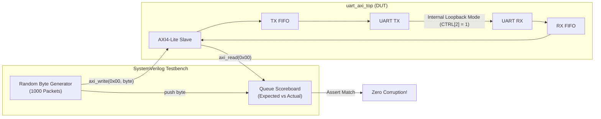

# Loopback Testing & Framing Error Injection

This note details the automated verification testbenches for **full duplex loopback data verification** and **controlled framing error injection and recovery**.

---

## 1. Loopback Verification Architecture



### Self-Checking Scoreboard Implementation
```systemverilog
byte expected_queue[$];
int mismatch_count = 0;

// Producer: Push random data into TX
for (int i = 0; i < 1000; i++) begin
    byte tx_val = $urandom_range(0, 255);
    expected_queue.push_back(tx_val);
    bfm.write_reg(32'h00, {24'h0, tx_val});
    
    // Periodically drain RX
    if ($urandom_range(0, 1)) begin
        logic [31:0] rx_val, stat;
        logic [1:0] resp;
        bfm.read_reg(32'h04, stat, resp);
        if (stat[4]) begin // RX_READY
            bfm.read_reg(32'h00, rx_val, resp);
            byte exp = expected_queue.pop_front();
            if (rx_val[7:0] !== exp) begin
                $error("[MISMATCH] Expected: 0x%02X, Got: 0x%02X", exp, rx_val[7:0]);
                mismatch_count++;
            end
        end
    end
end
```

---

## 2. Framing Error Injection & Recovery Sequence

To validate that the peripheral adheres to the resume claim:
> *"validated AXI handshake mechanism along with error recovery from framing errors"*

The testbench contains a dedicated error injection routine that intentionally corrupts the serial stop bit.

```
                  Start   D0    D1    D2    D3    D4    D5    D6    D7    STOP
       Normal:    --0---+-----+-----+-----+-----+-----+-----+-----+-----+---1---
       Injected:  --0---+-----+-----+-----+-----+-----+-----+-----+-----+---0---
                                                                            ^ Testbench forces 0!
```

### Testbench Task for Corrupted Frame Injection
```systemverilog
task inject_framing_error(input byte bad_data);
    $display("[TB] Injecting framing error with byte 0x%02X...", bad_data);
    
    // Disable internal loopback so testbench controls RX pin directly
    bfm.write_reg(32'h08, 32'h03); // TX_EN=1, RX_EN=1, LOOPBACK=0

    // Drive Start Bit
    tb_uart_rxd <= 1'b0;
    #(16 * BAUD_TICK_PERIOD);

    // Drive 8 Data Bits
    for (int i = 0; i < 8; i++) begin
        tb_uart_rxd <= bad_data[i];
        #(16 * BAUD_TICK_PERIOD);
    end

    // DRIVE CORRUPTED STOP BIT: Force 0 instead of 1!
    tb_uart_rxd <= 1'b0;
    #(16 * BAUD_TICK_PERIOD);

    // Verify Framing Error Status
    begin
        logic [31:0] stat;
        logic [1:0] resp;
        bfm.read_reg(32'h04, stat, resp);
        assert (stat[5] == 1'b1) else $error("Framing error flag failed to assert!");
        $display("[TB] PASS: Framing error flag detected in STATUS register.");
    end

    // RECOVERY VERIFICATION:
    // 1. Release line back to idle Mark (1)
    tb_uart_rxd <= 1'b1;
    #(32 * BAUD_TICK_PERIOD);

    // 2. Clear framing error flag via W1C in INTR_STAT
    bfm.write_reg(32'h14, 32'h04); // Write 1 to bit 2

    // 3. Transmit a valid frame immediately
    drive_valid_frame(8'h5A);

    // 4. Verify that 0x5A is cleanly captured and no framing error persists
    begin
        logic [31:0] rx_val, stat;
        logic [1:0] resp;
        bfm.read_reg(32'h04, stat, resp);
        assert (stat[5] == 1'b0) else $error("Framing error remained stuck!");
        assert (stat[4] == 1'b1) else $error("Valid byte not received after error!");
        bfm.read_reg(32'h00, rx_val, resp);
        assert (rx_val[7:0] == 8'h5A) else $error("Recovered data mismatch!");
        $display("[TB] PASS: Receiver successfully recovered from framing error!");
    end
endtask
```

[[04_ModelSim_Simulation_&_DO_Scripts|Next: ModelSim Simulation & DO Scripts ->]]
