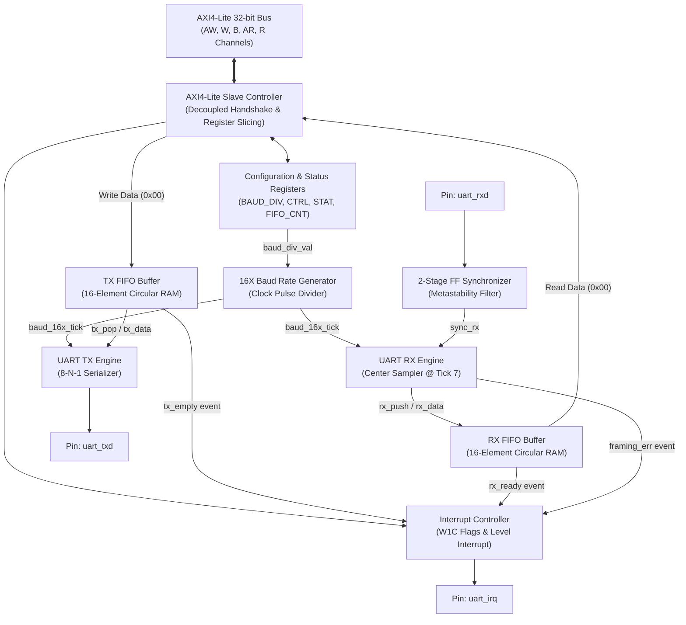
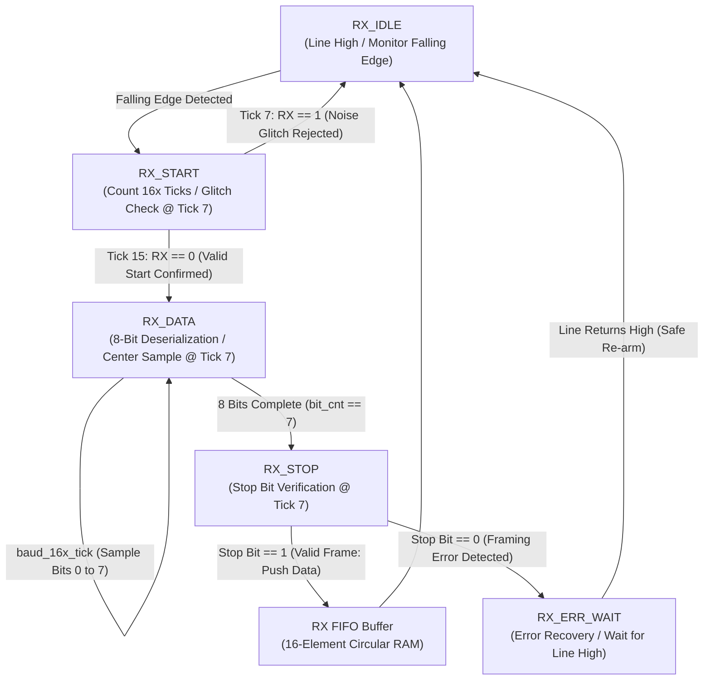
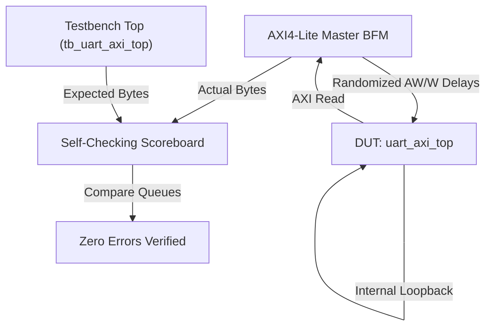

# AXI4-Lite UART Peripheral & FIFO Buffer

Synthesizable SystemVerilog implementation of an AMBA AXI4-Lite compliant UART (Universal Asynchronous Receiver-Transmitter) peripheral. The design features a fully decoupled 32-bit AXI4-Lite slave interface, 16-element independent circular FIFOs utilizing pointer rollover full/empty detection, a 16X oversampling clock divider with center-sampling receiver architecture, and a ModelSim verification suite featuring randomized AXI backpressure and framing error injection/recovery.

Repository: [https://github.com/sushrutchhatkuli/AXI4-Lite-UART-Peripheral-FIFO-Buffer](https://github.com/sushrutchhatkuli/AXI4-Lite-UART-Peripheral-FIFO-Buffer)

---

## Table of Contents
1. [Project Highlights](#project-highlights)
2. [Architecture Overview](#architecture-overview)
3. [Memory Map & Register Specifications](#memory-map--register-specifications)
4. [Baud Rate Generator & 16X Oversampling Math](#baud-rate-generator--16x-oversampling-math)
5. [UART Receiver with Center Sampling](#uart-receiver-with-center-sampling)
6. [UART Transmitter Engine](#uart-transmitter-engine)
7. [Circular FIFO Buffer (Pointer Rollover Method)](#circular-fifo-buffer-pointer-rollover-method)
8. [Clock Domain Crossing & Metastability](#clock-domain-crossing--metastability)
9. [Interrupt Architecture & Error Recovery](#interrupt-architecture--error-recovery)
10. [Verification & Simulation Suite](#verification--simulation-suite)
11. [FPGA Synthesis & Timing Results](#fpga-synthesis--timing-results)
12. [Repository Organization](#repository-organization)
13. [Simulation & Build Instructions](#simulation--build-instructions)

---

## Project Highlights

- **Synthesizable SystemVerilog Core**: Fully synthesizable RTL compliant with standard FPGA (Xilinx 7-Series/UltraScale+, Intel Cyclone/Arria) and ASIC synthesis flows.
- **AMBA AXI4-Lite Slave Interface**: Standard 32-bit data and address bus implementation supporting decoupled Write Address (`AW`) and Write Data (`W`) channels with independent latency tolerance.
- **16-Element Circular FIFOs**: Dedicated TX and RX buffers using the $(N+1)$-bit pointer rollover method, cleanly resolving full versus empty conditions without multi-bit counters on the critical path.
- **16X Oversampling & Center Sampling**: Samples incoming asynchronous serial bits at Tick 7 ($50\%$ eye midpoint), providing $\pm 43.75\%$ phase jitter margin and active glitch rejection.
- **2-Stage Flip-Flop CDC Synchronizer**: Isolates external asynchronous serial inputs with vendor-directed `ASYNC_REG` attributes to maximize MTBF against metastability.
- **Comprehensive Error Handling & Recovery**: Hardware detection for Framing Errors and FIFO Overrun Errors with dedicated resynchronization states (`ERR_WAIT`) preventing cascading false starts.
- **Verification Environment**: SystemVerilog testbench with AXI Master Bus Functional Model (BFM), randomized handshake wait states, queue-based self-checking scoreboard, and automated ModelSim scripts.

---

## Architecture Overview



### Module Hierarchy

```
uart_axi_top.sv                     Top-level peripheral integration
├── axi4_lite_slave.sv              AMBA AXI4-Lite bus interface and register file
├── fifo_circular.sv (tx_fifo)      16-entry circular buffer for transmit path
├── fifo_circular.sv (rx_fifo)      16-entry circular buffer for receive path
├── uart_baud_gen.sv                16X oversampling clock pulse generator
├── uart_tx.sv                      8-N-1 parallel-to-serial transmitter engine
└── uart_rx.sv                      8-N-1 serial-to-parallel center-sampling receiver
    └── 2-FF Synchronizer           Metastability resolution on external RX line
```

---

## Memory Map & Register Specifications

All registers are 32-bit word aligned. Accesses to unmapped address offsets return an AXI `SLVERR` (`2'b10`) response.

| Offset | Register Name | Access | Reset Value | Description |
| :---: | :--- | :---: | :---: | :--- |
| `0x00` | `UART_DATA` | R/W | `0x00000000` | Transmit Data Write / Receive Data Read |
| `0x04` | `UART_STATUS` | RO | `0x00000005` | Status flags (FIFO empty/full, errors, active states) |
| `0x08` | `UART_CTRL` | RW | `0x00000003` | Peripheral enable, loopback mode, and master interrupt enable |
| `0x0C` | `UART_BAUD_DIV` | RW | `0x00000035` | 16-bit baud divisor value (default: 53 for 115200 @ 100MHz) |
| `0x10` | `UART_FIFO_CNT` | RO | `0x00000000` | Live occupancy counters for TX and RX FIFOs |
| `0x14` | `UART_INTR_STAT` | W1C | `0x00000000` | Interrupt status flags (Write-1-to-Clear) |
| `0x18` | `UART_INTR_EN` | RW | `0x00000000` | Interrupt enable mask |

### Register Bitfield Details

#### `0x00`: `UART_DATA` (Transmit / Receive Data)
- **Write**: Pushes `WDATA[7:0]` into TX FIFO. Writes while TX FIFO is full are dropped and assert `OVERRUN_ERR`.
- **Read**: Returns oldest byte from RX FIFO on `RDATA[7:0]` and pops the buffer. Reads while empty return `0x00`.

#### `0x04`: `UART_STATUS` (Status Register - Read Only)
- `Bit 0`: `TX_EMPTY` (1 = Transmit FIFO has no pending data)
- `Bit 1`: `TX_FULL` (1 = Transmit FIFO contains 16 words; cannot accept writes)
- `Bit 2`: `RX_EMPTY` (1 = Receive FIFO has no data)
- `Bit 3`: `RX_FULL` (1 = Receive FIFO contains 16 unread words)
- `Bit 4`: `RX_DATA_READY` (1 = At least one valid byte waiting in RX FIFO)
- `Bit 5`: `FRAMING_ERR` (1 = Stop bit sampled as 0; sticky until cleared via `INTR_STAT`)
- `Bit 6`: `OVERRUN_ERR` (1 = A byte was dropped because its FIFO was full, either received while the RX FIFO was full or written while the TX FIFO was full; sticky until cleared via `INTR_STAT`)
- `Bit 7`: `TX_BUSY` (1 = Transmitter actively shifting out a frame)
- `Bit 8`: `RX_BUSY` (1 = Receiver actively deserializing a frame)

#### `0x08`: `UART_CTRL` (Control Register - Read/Write)
- `Bit 0`: `TX_EN` (1 = Enable UART transmitter; 0 = Hold transmitter idle)
- `Bit 1`: `RX_EN` (1 = Enable UART receiver; 0 = Disable receiver)
- `Bit 2`: `LOOPBACK_EN` (1 = Internal digital loopback: connects internal TX output directly to RX input)
- `Bit 3`: `INTR_GLOBAL_EN` (1 = Master interrupt enable gate)

#### `0x0C`: `UART_BAUD_DIV` (Baud Rate Divisor - Read/Write)
- `Bits [15:0]`: 16-bit integer divider value:
  $$\text{DIVISOR} = \text{round}\left(\frac{f_{\text{clk}}}{16 \times \text{Baud Rate}}\right) - 1$$

#### `0x10`: `UART_FIFO_CNT` (FIFO Occupancy Count - Read Only)
- `Bits [4:0]`: `TX_COUNT` (Number of bytes in TX FIFO, range 0 to 16)
- `Bits [12:8]`: `RX_COUNT` (Number of bytes in RX FIFO, range 0 to 16)

#### `0x14`: `UART_INTR_STAT` (Interrupt Status - Write-1-to-Clear)
- `Bit 0`: `TX_EMPTY_INT` (Triggered on TX FIFO transition to empty)
- `Bit 1`: `RX_READY_INT` (Triggered on new byte arrival into empty RX FIFO)
- `Bit 2`: `FRAMING_ERR_INT` (Triggered on stop-bit framing violation)
- `Bit 3`: `OVERRUN_ERR_INT` (Triggered on FIFO overflow data drop)

---

## Baud Rate Generator & 16X Oversampling Math

Asynchronous communication requires local oversampling to recover clock phase. The internal baud generator creates a single-clock-cycle strobe (`baud_16x_tick`) every $\frac{1}{16\text{th}}$ of a serial bit period.

### Divisor Equation
For a master clock frequency $f_{\text{clk}}$ and target baud rate $B$:

$$\text{DIVISOR} = \text{round}\left(\frac{f_{\text{clk}}}{16 \times B}\right) - 1$$

$$\text{Actual Baud Rate } (B_{\text{actual}}) = \frac{f_{\text{clk}}}{16 \times (\text{DIVISOR} + 1)}$$

$$\text{Percentage Error } (\%) = \left(\frac{B_{\text{actual}} - B}{B}\right) \times 100\%$$

### Precision Table ($f_{\text{clk}} = 100\text{ MHz}$)

| Target Baud (bps) | Calculated Ratio | Divisor (Dec) | Divisor (Hex) | Actual Baud (bps) | Error (%) | Margin Status |
| :---: | :---: | :---: | :---: | :---: | :---: | :---: |
| **9,600** | 651.042 | **650** | `0x028A` | 9,600.61 | **+0.006%** | Optimal |
| **19,200** | 325.521 | **325** | `0x0145` | 19,201.23 | **+0.006%** | Optimal |
| **38,400** | 162.760 | **162** | `0x00A2` | 38,402.46 | **+0.006%** | Optimal |
| **57,600** | 108.507 | **108** | `0x006C` | 57,339.45 | **-0.452%** | High Margin |
| **115,200** | 54.253 | **53** | `0x0035` | 115,740.74 | **+0.469%** | High Margin |
| **230,400** | 27.127 | **26** | `0x001A` | 231,481.48 | **+0.469%** | High Margin |
| **460,800** | 13.563 | **13** | `0x000D` | 446,428.57 | **-3.119%** | Acceptable (< 3.75%) |

### Timing Error Budget Analysis
In an 8-N-1 frame:
- 1 Start Bit + 8 Data Bits + 1 Stop Bit = 10 total bit periods.
- The stop bit center is sampled at $t = 9.5 \times T_{\text{bit}}$ after the start edge.
- The maximum permissible cumulative clock drift over $9.5$ bit periods before drifting into an adjacent bit boundary is:
  $$\text{Drift}_{\text{max}} = \frac{\pm 0.5 \times T_{\text{bit}}}{9.5 \times T_{\text{bit}}} \approx \pm 5.26\%$$
- Factoring in line capacitance and rise/fall slew rates, the practical limit is $\pm 3.75\%$. At 115,200 baud, our error of $+0.469\%$ uses less than one-eighth of the allowable budget.

---

## UART Receiver with Center Sampling

The receiver engine samples incoming serial data using an oversampling counter running from 0 to 15.

```
       Bit Boundary                   Midpoint (Sample Point)       Bit Boundary
       |                              |                             |
       +------------------------------+-----------------------------+
       Tick 0                      Tick 7                        Tick 15
       <------- 7 Ticks Margin -------> <------- 8 Ticks Margin ------>
```

### Center Sampling & Noise Rejection Rationale
1. **Start Bit Glitch Filter**: Upon detecting a falling edge on the synchronized RX line, the receiver initializes its counter and samples the line at **Tick 7**. If the signal has returned to logic 1, the event is classified as a transient noise pulse ($< T_{\text{bit}}/2$) and rejected without advancing the FSM.
2. **Symmetrical Timing Margin**: Sampling at Tick 7 provides a symmetrical $\pm 7$-tick window ($\pm 43.75\%$ of the bit duration), maximizing tolerance against phase jitter, line distortion, and transmitter frequency mismatch.
3. **Framing Error Detection**: At Tick 7 of the stop bit window, the receiver verifies logic 1. If logic 0 is sampled, `FRAMING_ERR` is raised, and the corrupted byte is discarded.



---

## UART Transmitter Engine

The transmitter serializes 8-bit parallel data from the TX FIFO into an 8-N-1 frame:
1. **`TX_IDLE`**: Transmit line rests at Mark (logic 1). When `!tx_empty && tx_en`, the FSM asserts `tx_pop`, captures the byte into an internal shift register, and transitions to `TX_START`.
2. **`TX_START`**: Drives logic 0 for 16 oversampling ticks ($1 \times T_{\text{bit}}$).
3. **`TX_DATA`**: Shifts out data bits LSB-first (`D0` to `D7`), holding each bit for 16 oversampling ticks.
4. **`TX_STOP`**: Drives logic 1 for 16 oversampling ticks.
5. **Zero-Bubble Burst Streaming**: At Tick 15 of `TX_STOP`, if the TX FIFO is not empty, the next byte is fetched immediately without inserting idle cycles, achieving $100\%$ theoretical line utilization ($11.52\text{ KB/s}$ at 115,200 baud).

---

## Circular FIFO Buffer (Pointer Rollover Method)

Rather than utilizing an up/down occupancy counter that places multi-bit arithmetic adders on the critical path, the TX and RX buffers implement the **$(N+1)$-Bit Pointer Rollover Architecture**.

```
       5-bit Pointer:
       +--------+--------+--------+--------+--------+
       | Bit 4  | Bit 3  | Bit 2  | Bit 1  | Bit 0  |
       +--------+--------+--------+--------+--------+
           |        \______________________________/
           |                       |
       Rollover Phase               4-bit RAM Address
         (MSB)                         (0 to 15)
```

### Mathematical Formulation
For buffer depth $D = 16$:
- Address width: $N = \log_2(16) = 4\text{ bits}$ (`[3:0]`).
- Pointer width: $N + 1 = 5\text{ bits}$ (`[4:0]`).

#### Empty Condition
The FIFO is empty when both write and read pointers are identical across all 5 bits:
$$\text{EMPTY} = (\text{wptr}[4:0] == \text{rptr}[4:0])$$

#### Full Condition
The FIFO is full when the physical addresses match, but the rollover phase bits (MSBs) differ (the write pointer has wrapped around exactly once more than the read pointer):
$$\text{FULL} = (\text{wptr}[4] \ne \text{rptr}[4]) \land (\text{wptr}[3:0] == \text{rptr}[3:0])$$

#### Instantaneous Word Count
$$\text{COUNT}[4:0] = \text{wptr}[4:0] - \text{rptr}[4:0]$$

By exploiting two's complement modulo-$2^5$ subtraction, this single expression yields the correct occupancy count ($0$ to $16$) across all wrap-around conditions.

---

## Clock Domain Crossing & Metastability

External serial signals arrive asynchronously relative to the peripheral system clock. Sampling asynchronous inputs directly into sequential registers can cause setup/hold violations leading to metastability.

```
       External RX ---> [ FF Stage 1 ] ---> [ FF Stage 2 ] ---> Synchronized RX
       (Asynchronous)     (Metastable)        (Resolved)          (Safe to use)
```

### Hardware Isolation
1. **2-Stage D-FF Synchronizer**: Attenuates metastable states across two successive clock edges.
2. **Synthesis Placement Directives**: Annotated with `(* ASYNC_REG = "TRUE" *)` to force synthesis and place-and-route tools to place both registers in the same physical slice, minimizing interconnect delay and maximizing resolution time $t_{\text{resolve}}$.
3. **Calculated MTBF**: With $t_{\text{resolve}} \approx 9.5\text{ ns}$ at $100\text{ MHz}$, the calculated Mean Time Between Failures exceeds $10^8$ years.

---

## Interrupt Architecture & Error Recovery

### Interrupt Sources
- **`TX_EMPTY`**: Generated when transmit FIFO transitions from non-empty to empty, alerting the processor to stage the next data block.
- **`RX_READY`**: Generated when receive FIFO contains one or more unread bytes.
- **`FRAMING_ERR`**: Generated when stop bit is sampled as logic 0.
- **`OVERRUN_ERR`**: Generated whenever a byte is dropped because its FIFO was full, covering both a received byte arriving at a full RX FIFO and an AXI write landing on a full TX FIFO.

### Write-1-to-Clear (W1C) Implementation
To eliminate the hardware-software race conditions inherent in legacy Read-to-Clear registers:
- Writing 0 leaves the bit state unchanged.
- Writing 1 clears the specified flag.
- Hardware event assertions take atomic precedence over software clearing operations occurring on the same cycle.

### Framing Error Recovery
If a framing error occurs (e.g. during a line break or severed cable), jumping directly to `IDLE` while the line is low would trigger an immediate false start bit. Our receiver transitions to a dedicated `ERR_WAIT` state, holding until the line returns to Mark (logic 1), ensuring clean resynchronization on the next valid transmission.

---

## Verification & Simulation Suite

The verification environment is implemented in SystemVerilog, targeting Mentor Graphics ModelSim / QuestaSim.



### Verification Highlights
- **Randomized Channel Skew**: Evaluates independent `AW` and `W` transaction phases by injecting pseudo-random delays (0 to 10 cycles), ensuring the slave never deadlocks when data arrives prior to address or vice versa.
- **Backpressure Testing**: Randomly asserts wait states on `BREADY` and `RREADY`, verifying that the slave maintains stable valid outputs according to AMBA rules.
- **Digital Loopback Regression**: Verifies 1000+ pseudo-random byte transfers in internal loopback mode (`CTRL[2] = 1`) with an automated self-checking queue scoreboard.
- **Error Injection Test**: A dedicated testbench routine overrides the serial line to logic 0 during the stop bit window, confirming that `FRAMING_ERR` asserts, the byte is rejected, and subsequent valid frames are captured cleanly after W1C clearance.

---

## FPGA Synthesis & Timing Results

The peripheral was synthesized targeting an **AMD/Xilinx Artix-7** FPGA (`xc7a35tcsg324-1`) using **AMD Vivado 2025.1** in non-project batch mode with an out-of-context synthesis flow.

### Timing Performance Summary

| Metric | Target Constraint | Measured Result | Status |
| :--- | :---: | :---: | :---: |
| **Clock Frequency ($f_{\text{clk}}$)** | 100.000 MHz ($T_{\text{clk}} = 10.000\text{ ns}$) | **224.31 MHz** ($T_{\text{min}} = 4.458\text{ ns}$) | MET |
| **Worst Negative Slack (WNS)** | $> 0.000\text{ ns}$ | **+5.542 ns** | MET (0 failing endpoints / 901) |
| **Worst Hold Slack (WHS)** | $> 0.000\text{ ns}$ | **+0.164 ns** | MET (0 failing endpoints / 901) |
| **Worst Pulse Width Slack (WPWS)** | $> 0.000\text{ ns}$ | **+4.500 ns** | MET (0 failing endpoints / 501) |
| **Total Negative Slack (TNS)** | $0.000\text{ ns}$ | **0.000 ns** | MET |
| **Total Hold Slack (THS)** | $0.000\text{ ns}$ | **0.000 ns** | MET |

### Resource Utilization Breakdown (Artix-7 xc7a35t)

| Resource | Used | Available | Utilization % | Design Notes |
| :--- | :---: | :---: | :---: | :--- |
| **Slice LUTs** | 314 | 20,800 | 1.51% | All logic, decode, and arithmetic |
| **LUT as Logic** | 314 | 20,800 | 1.51% | Decoupled AXI slave, baud generator, FSMs |
| **LUT as Memory (Distributed)**| 0 | 9,600 | 0.00% | Circular FIFOs synthesized as flip-flop registers |
| **Slice Registers (Flip-Flops)** | 501 | 41,600 | 1.20% | Dual 16x8 FIFO arrays, pipeline stages, CDC |
| **Registers as Latches** | **0** | 41,600 | **0.00%** | Clean synchronous RTL: zero unintended latches |
| **F7 / F8 Multiplexers** | 34 (28 / 6) | 24,450 | 0.14% | Wide 32-bit register readback multiplexing |
| **Block RAM (RAMB18/RAMB36)** | 0 | 50 | 0.00% | Small buffer footprint does not consume BRAM tiles |
| **DSP48 Slices** | 0 | 90 | 0.00% | Purely synchronous logic; no multiplier overhead |

### Key Hardware Implementation Takeaways

1. **High Timing Margin**: At 100 MHz, the design achieves $+5.542\text{ ns}$ of positive setup slack, enabling operation up to **224 MHz** without pipelining additions.
2. **Zero Inferred Latches**: 100% of sequential elements are synchronous D-type flip-flops with explicit reset conditions, preventing timing hazards and race conditions.
3. **Low Footprint**: The complete peripheral (dual 16-word FIFOs, baud generator, serializer, deserializer, and AXI4-Lite slave interface) consumes only 314 LUTs and 501 FFs, making it suitable for compact SoC integration.

---

## Repository Organization

```
.
├── README.md                           Project documentation and specifications
├── rtl/                                Synthesizable SystemVerilog Source Code
│   ├── uart_pkg.sv                     Package containing register offsets and constants
│   ├── fifo_circular.sv                16-element circular FIFO (pointer rollover)
│   ├── uart_baud_gen.sv                16X oversampling baud rate pulse generator
│   ├── uart_tx.sv                      8-N-1 UART transmitter engine
│   ├── uart_rx.sv                      8-N-1 UART receiver with center sampling
│   ├── axi4_lite_slave.sv              AMBA AXI4-Lite slave and register file
│   └── uart_axi_top.sv                 Top-level peripheral integration
├── tb/                                 Verification Suite
│   ├── axi4_lite_if.sv                 SystemVerilog interface definition
│   ├── axi_master_bfm.sv               Bus Functional Model with randomized latencies
│   ├── tb_uart_axi_top.sv              Self-checking testbench (20 self-checking assertions)
│   ├── run_sim.do                      ModelSim batch compilation and execution script
│   ├── run_xsim.bat                    Vivado xsim compile / elaborate / run script
│   └── wave.do                         ModelSim waveform setup script
├── synth/                              FPGA Synthesis Scripts & Reports (Artix-7)
│   ├── synth.tcl                       Vivado non-project batch synthesis script
│   ├── run_synth.bat                   Out-of-context synthesis batch runner
│   ├── utilization.rpt                 Resource utilization report (314 LUTs, 501 FFs)
│   └── timing.rpt                      Static timing report (WNS +5.542 ns, Fmax 224 MHz)
└── docs/                               Obsidian Knowledge Base (Detailed Specs)
    ├── 00 - Index & Overview/          MOC and resume specification traceability
    ├── 01 - AMBA AXI4-Lite Protocol/   Protocol rules and register bitfields
    ├── 02 - Baud Rate & Clocking/      Clock division math and CDC analysis
    ├── 03 - UART Transmitter (TX)/     Transmitter FSM and timing
    ├── 04 - UART Receiver (RX)/        Receiver FSM, center sampling, and error recovery
    ├── 05 - Circular FIFO Buffer/      Pointer rollover proofs and RAM implementation
    ├── 06 - Top-Level Integration/     Interconnect wiring and interrupt controller
    ├── 07 - Verification & Testbench/  Verification matrix and BFM tasks
    └── 08 - Interview Prep & Deep-Dive/25+ Technical interview questions and tradeoffs
```

---

## Simulation & Build Instructions

### Prerequisites
- A SystemVerilog simulator: AMD/Xilinx Vivado (`xsim`) or Mentor ModelSim / QuestaSim
- Git

### Running Simulation (Vivado xsim)
With Vivado's `bin` directory on `PATH`, from the repository root:
```bat
tb\run_xsim.bat
```
The script compiles the RTL and testbench with `xvlog`, elaborates with `xelab`, and runs
the suite to completion with `xsim -R`.

### Running Out-of-Context Synthesis (AMD Vivado)
To run out-of-context synthesis and static timing analysis targeting the Artix-7 FPGA:
```bat
synth\run_synth.bat
```
The flow outputs detailed resource utilization and timing slack reports into `synth/utilization.rpt` and `synth/timing.rpt`.

### Running Simulation (ModelSim GUI)
1. Launch ModelSim.
2. Change directory to the `tb/` folder:
   ```tcl
   cd <path-to-repo>/tb
   ```
3. Execute the automated DO script:
   ```tcl
   do run_sim.do
   ```

### Running Simulation in Batch Mode (Command Line)
```bash
vsim -c -do "do run_sim.do; quit -f"
```

The testbench runs nine test cases (20 self-checking assertions in total), reports per-test status with timestamps to the transcript, checks scoreboards, and prints a final pass/fail summary. A global watchdog fails the run rather than hanging if a handshake ever stalls.

---

## License
Distributed under the MIT License. See `LICENSE` for details.

## Author
**Sushrut Chhatkuli**
- GitHub: [@sushrutchhatkuli](https://github.com/sushrutchhatkuli)
- Repository: [AXI4-Lite-UART-Peripheral-FIFO-Buffer](https://github.com/sushrutchhatkuli/AXI4-Lite-UART-Peripheral-FIFO-Buffer)
