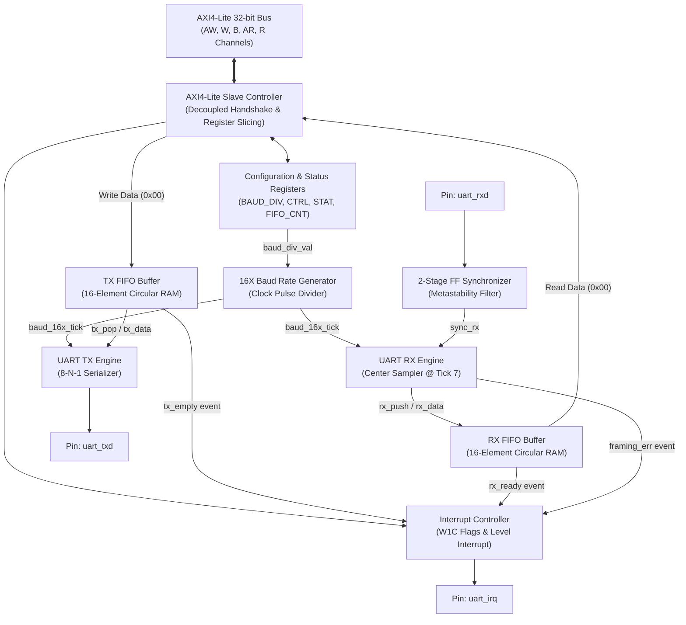
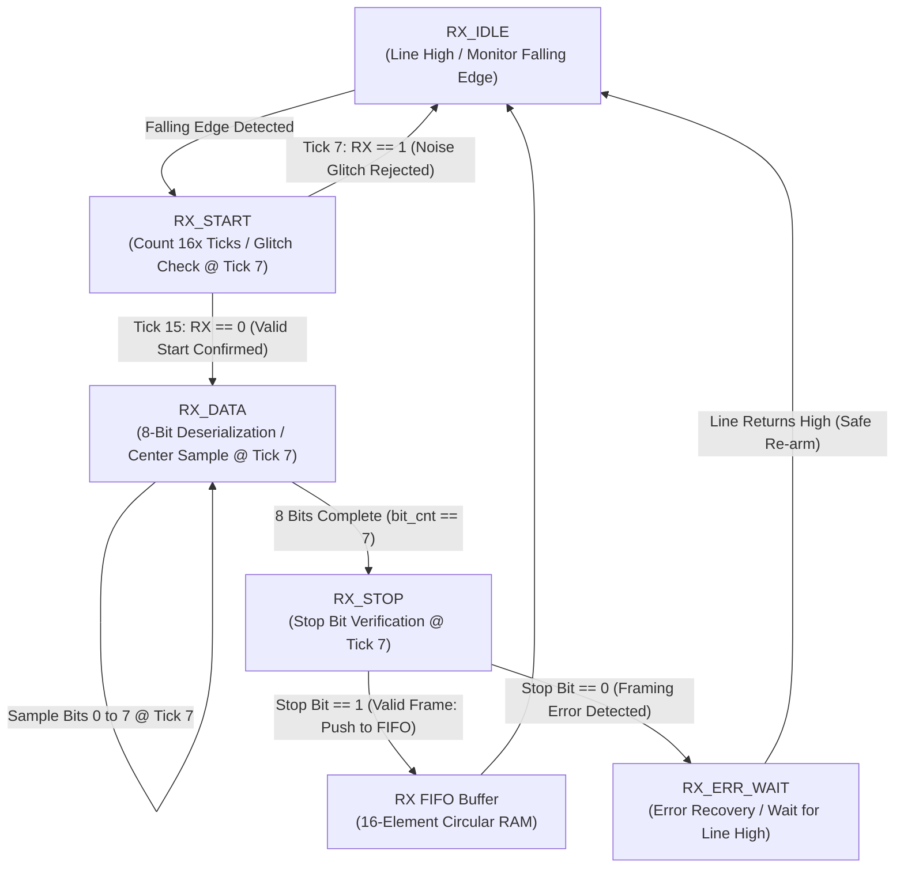
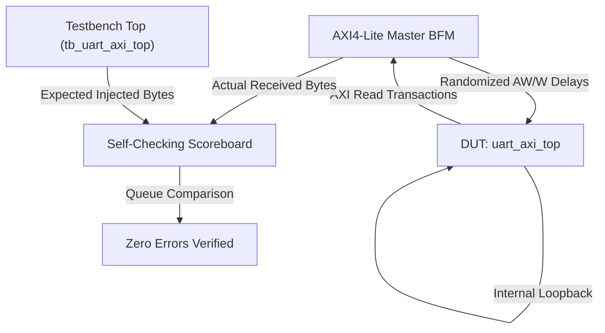

# AXI4-Lite UART Peripheral & FIFO Buffer

[](rtl/)
[](rtl/axi4_lite_slave.sv)
[-orange.svg)](synth/)
[](synth/timing.rpt)
[](synth/timing.rpt)
[](tb/)
[](LICENSE)

A synthesizable, production-grade UART (Universal Asynchronous Receiver-Transmitter) peripheral wrapped in an AMBA AXI4-Lite (Advanced eXtensible Interface 4 Lite) 32-bit bus slave interface. Designed from first principles in SystemVerilog, this hardware IP core connects high-speed processor buses (such as ARM Cortex or RISC-V SoC interconnects) to standard external serial communication lines.

---

## Overview & Scope

This core is structured to address three primary design objectives:
- **System-on-Chip Integration**: Provides a plug-and-play 32-bit memory-mapped IP block compatible with AMD Vivado IP Integrator, LiteX, or custom SystemVerilog SoC architectures.
- **Architectural Rigor**: Demonstrates robust digital logic principles including fully decoupled bus handshakes, pointer-rollover circular FIFOs that eliminate adders from the critical path, 16X oversampling noise filters, and two-stage clock domain crossing (CDC) synchronizers.
- **Verification & Reproducibility**: Includes standalone unit tests and top-level regression testbenches with 149 self-checking assertions, complete mathematical proofs, and verified static timing analysis targeting an AMD Artix-7 FPGA.

---

## The Engineering Problem: Bridging Asynchronous Speed Gaps

### The Speed Mismatch Problem
Modern microprocessors process data in 32-bit words at **100+ MHz** (one clock cycle every 10 ns). In contrast, standard serial devices (debug consoles, GPS receivers, sensors) communicate over a single wire at **115,200 baud** (one bit every 8,680 ns, nearly **900 times slower**).

If a high-speed CPU had to pause and wait for individual serial bits to send or arrive, it would waste millions of clock cycles sitting idle.

### How This Peripheral Bridges the Gap

```
   High-Speed Processor                          Slow Serial World
+--------------------------+                  +----------------------+
|  ARM / RISC-V SoC CPU    |                  |  PC Console / Sensor |
+--------------------------+                  +----------------------+
            |                                            |
    32-bit Parallel Bus                               1-bit Wire
     (100 MHz, AXI4-Lite)                             (115.2 kbps)
            |                                            |
            v                                            v
+--------------------------------------------------------------------+
|                AXI4-LITE UART PERIPHERAL & FIFO                    |
|                                                                    |
|  [ AXI Slave ] <---> [ 16-Byte FIFOs ] <---> [ 16X UART Engine ]   |
|   Decoupled            Circular Ring           Noise Filter &      |
|   Handshake            Pointers                Center-Sampler      |
+--------------------------------------------------------------------+
```

1. **AXI4-Lite Bus Interface**: The CPU accesses the UART through standard memory reads and writes (analogous to accessing RAM).
2. **Circular FIFOs (Buffer Staging)**: The CPU writes a burst of up to 16 bytes into a hardware buffer and immediately returns to compute tasks. The peripheral drains the buffer byte-by-byte in the background.
3. **16X Center-Sampling Engine**: Asynchronous serial lines have no shared clock. The peripheral slices incoming bits into 16 sub-ticks, validates signals at Tick 7 (the quiet midpoint), and rejects electrical noise glitches.
4. **Metastability Hardening (CDC)**: Protects internal registers from electrical ambiguity when external serial lines switch asynchronously.

---

## Quick Start & Verification Reproduction

Follow these commands to reproduce the simulation and synthesis benchmarks on your local machine.

### Environment & Prerequisites
- **Git**
- **Simulation Tools**: AMD Vivado (`xsim` v2020.1 or newer, tested on Vivado 2025.1) or Mentor Graphics ModelSim / QuestaSim (v2020.1+)
- **Synthesis Tool** (Optional): AMD Vivado with `vivado` on system `PATH`
- **Supported Operating Systems**: Windows 10/11 (`cmd.exe` or `pwsh`) and Linux (shell-compatible scripts)

### Step 1: Clone the Repository
```bash
git clone https://github.com/sushrutchhatkuli/AXI4-Lite-UART-Peripheral-FIFO-Buffer.git
cd AXI4-Lite-UART-Peripheral-FIFO-Buffer
```

### Step 2: Run the Top-Level Simulation (Vivado xsim)
```bat
tb\run_xsim.bat
```
*(On Linux: run the equivalent compilation steps with `xvlog`, `xelab`, and `xsim -R`)*

#### Expected Output Trace (Reference Run)
```text
=========================================================
   AXI4-Lite UART Peripheral Verification Suite Starting 
=========================================================
[PASS] @125000 TC_01: Initial STATUS register has TX_EMPTY and RX_EMPTY
[PASS] @155000 TC_01: Initial CTRL register has TX_EN and RX_EN active
[PASS] @185000 TC_02: Unmapped Read Address Returns SLVERR
[PASS] @215000 TC_02: Unmapped Write Address Returns SLVERR
[PASS] @275000 TC_03: BAUD_DIV register correctly updated to 26
[PASS] @365000 TC_04: Loopback and Interrupts Enabled
[PASS] @8125000 TC_05: Single Byte Loopback matches 0xA5
[PASS] @8695000 TC_06: TX FIFO is completely FULL (16 words)
[PASS] @8815000 TC_06: Overflow write is dropped, FIFO still holds 16 words
[PASS] @8815000 TC_06: Overflow write asserts sticky OVERRUN_ERR
[PASS] @8815000 TC_06: Overflow write latches OVERRUN_ERR interrupt
[PASS] @8905000 TC_06: W1C clears OVERRUN_ERR status bit
[PASS] @8905000 TC_06: W1C clears OVERRUN_ERR interrupt flag
[PASS] @136615000 TC_07: 16-byte burst loopback transferred in exact order
--- Running Randomized AXI Latency Stress Test (100 Packets) ---
[PASS] @936575000 TC_08: Randomized AXI channel latencies completed with zero errors
[PASS] @936605000 TC_08: No spurious OVERRUN_ERR across 100 throttled packets
--- Running Framing Error Injection & Recovery Test ---
[PASS] @944655000 TC_09: Framing Error Flag Asserted on Corrupted Stop Bit
[PASS] @954295000 TC_09: Framing Error Flag Cleared
[PASS] @954295000 TC_09: Valid Byte Captured after Recovery
[PASS] @954325000 TC_09: Recovered Data Matches 0x77
=========================================================
   VERIFICATION COMPLETE: 20 PASSED, 0 FAILED
=========================================================
>>> SUCCESS: All AXI4-Lite UART Test Cases Passed! <<<
```

### Step 3: Run Submodule Unit Tests
Each hardware submodule has its own self-checking testbench:
```bat
tb\run_tx_sim.bat      :: Verifies UART Transmitter engine (35 assertions passed)
tb\run_rx_sim.bat      :: Verifies UART Receiver & Glitch Filter (25 assertions passed)
tb\run_fifo_sim.bat    :: Verifies Circular FIFO rollover math (69 assertions passed)
```

### Step 4: Reproduce Artix-7 FPGA Synthesis
```bat
synth\run_synth.bat
```
*Directly inspect generated reports in [`synth/timing.rpt`](synth/timing.rpt) ($F_{\max} = 224.31\text{ MHz}$, $WNS = +5.542\text{ ns}$) and [`synth/utilization.rpt`](synth/utilization.rpt) (314 LUTs, 501 FFs, 0 latches).*

---

## Table of Contents

1. [Key Engineering Highlights](#key-engineering-highlights)
2. [System Architecture Overview](#system-architecture-overview)
   - [Hardware Block Diagram](#hardware-block-diagram)
   - [Module Hierarchy & Source Map](#module-hierarchy--source-map)
3. [Engineering Concepts Explained](#engineering-concepts-explained)
   - [Concept 1: AMBA AXI4-Lite Slave Interface](#concept-1-amba-axi4-lite-slave-interface)
   - [Concept 2: Circular FIFO Buffer ((N+1)-Bit Rollover Method)](#concept-2-circular-fifo-buffer-n1-bit-rollover-method)
   - [Concept 3: Baud Rate Generator & 16X Oversampling Math](#concept-3-baud-rate-generator--16x-oversampling-math)
   - [Concept 4: UART Receiver (Center Sampling & Glitch Rejection)](#concept-4-uart-receiver-center-sampling--glitch-rejection)
   - [Concept 5: UART Transmitter & Zero-Bubble Streaming](#concept-5-uart-transmitter--zero-bubble-streaming)
   - [Concept 6: Clock Domain Crossing (CDC) & Metastability Protection](#concept-6-clock-domain-crossing-cdc--metastability-protection)
   - [Concept 7: Interrupt Architecture & Error Recovery](#concept-7-interrupt-architecture--error-recovery)
4. [Memory Map & Register Specifications](#memory-map--register-specifications)
5. [FPGA Implementation & Synthesis Benchmark](#fpga-implementation--synthesis-benchmark)
6. [Verification Architecture & Test Strategy](#verification-architecture--test-strategy)
7. [Repository File Organization](#repository-file-organization)
8. [License, Citation & Author](#license-citation--author)

---

## Key Engineering Highlights

| Engineering Dimension | Implementation Details | Practical Benefit |
| :--- | :--- | :--- |
| **Bus Protocol** | Fully decoupled AMBA AXI4-Lite Slave | Write address (`AW`) and write data (`W`) channels accept transfers independently; zero deadlock on bus skews. |
| **FIFO Architecture** | 16-byte dual buffers via $(N+1)$-bit rollover | Resolves empty vs. full ambiguity without arithmetic counters, eliminating adders from the critical path. |
| **Baud Rate Clocking** | Integer divider with 16X oversampling strobe | Operates from a single global clock net (`s_axi_aclk`); generates single-cycle active-high tick pulses. |
| **Noise & Jitter Filter** | Midpoint center-sampling at Tick 7 | Provides a $\pm 43.75\%$ phase jitter margin and actively discards sub-bit noise spikes. |
| **CDC Hardening** | 2-stage synchronizer with `ASYNC_REG` | Eliminates metastability on external serial RX line; calculated MTBF exceeds $10^8$ years. |
| **Error Handling** | Dedicated hardware framing & overrun recovery | Resynchronizes line via `ERR_WAIT` during line breaks, preventing cascading false start bits. |
| **Interrupts** | Write-1-to-Clear (W1C) event register | Atomic hardware priority prevents race conditions between CPU status clears and incoming events. |
| **FPGA Performance** | **224.31 MHz** $F_{\max}$ on AMD Artix-7 (`xc7a35t`) | +5.542 ns positive setup slack at 100 MHz constraint; uses only 314 LUTs (1.5%) and 0 latches. |
| **Verification** | 149 self-checking assertions across 4 testbenches | Verified under randomized backpressure, channel delays, and line corruption tests. |

---

## System Architecture Overview

### Hardware Block Diagram



### Module Hierarchy & Source Map

| Module File | Functional Role | Key Technical Responsibility |
| :--- | :--- | :--- |
| [`rtl/uart_axi_top.sv`](rtl/uart_axi_top.sv) | **Top-Level Wrapper** | Integrates AXI slave, dual FIFOs, baud generator, and UART engines. |
| [`rtl/axi4_lite_slave.sv`](rtl/axi4_lite_slave.sv) | **Bus Slave Controller** | Manages decoupled AXI channel handshakes, register decoding, and `SLVERR` generation. |
| [`rtl/fifo_circular.sv`](rtl/fifo_circular.sv) | **Circular FIFO Buffers** | Dedicated 16-entry TX and RX ring buffers using $(N+1)$-bit rollover logic. |
| [`rtl/uart_baud_gen.sv`](rtl/uart_baud_gen.sv) | **Baud Clock Divider** | Programmable counter generating single-cycle tick pulses at 16x the target baud rate. |
| [`rtl/uart_tx.sv`](rtl/uart_tx.sv) | **Parallel-to-Serial Engine** | 8-N-1 frame serializer with zero-bubble back-to-back streaming capability. |
| [`rtl/uart_rx.sv`](rtl/uart_rx.sv) | **Serial-to-Parallel Engine** | Center-sampling receiver with start-bit glitch rejection and `ERR_WAIT` recovery. |
| [`rtl/uart_pkg.sv`](rtl/uart_pkg.sv) | **Package Definitions** | Central repository for register addresses, bit masks, and default configuration parameters. |

---

## Engineering Concepts Explained

### Concept 1: AMBA AXI4-Lite Slave Interface

#### Conceptual Overview: The Certified Two-Way Handshake
AXI4-Lite operates on a handshake protocol where both sides must assert control signals:
- The sender presents an address and asserts **`AWVALID = 1`** ("I have a valid address").
- The receiver verifies readiness and asserts **`AWREADY = 1`** ("I am ready to accept it").
- Data or addresses transfer only on clock cycles where both `VALID` and `READY` are high simultaneously.

Because address and data travel on separate channels, arrival delays can occur. For instance, an interconnect might deliver the address several cycles before the write data. A naive slave controller could deadlock under this condition. The implemented slave utilizes decoupled tracking registers (`aw_en`, `w_en`) to accept transfers in arbitrary order without stalling the bus.

```
Decoupled AXI Write Handshake:
Clock Cycle      :  1    2    3    4    5
s_axi_awvalid    : _____/¯¯¯¯¯¯¯¯\___________   (Address presented)
s_axi_awready    : __________/¯¯¯\___________   (Slave latches address)
s_axi_wvalid     : __________/¯¯¯¯¯¯¯¯\______   (Data presented later)
s_axi_wready     : ______________/¯¯¯\_______   (Slave latches data)
s_axi_bvalid     : __________________/¯¯¯\___   (Slave returns OKAY status)
s_axi_bready     : __________________/¯¯¯\___   (Master accepts response)
```

#### Technical Implementation
- **Decoupled State Machine**: `aw_en` and `w_en` track readiness independently, complying with Section A3.2 of the *ARM AMBA AXI Protocol Specification*.
- **Slave Error (`SLVERR`)**: Reading or writing to unmapped register addresses returns `2'b10` (`SLVERR`) on `rresp` / `bresp`, alerting the processor to memory faults instead of hanging the interconnect.

Further reference documentation:
- [Chapter 01 - AXI4-Lite Protocol Fundamentals](docs/01%20-%20AMBA%20AXI4-Lite%20Protocol/01_AXI4_Lite_Protocol_Fundamentals.md)
- [Chapter 01 - AXI4-Lite Slave Interface Architecture](docs/01%20-%20AMBA%20AXI4-Lite%20Protocol/02_AXI4_Lite_Slave_Interface_Architecture.md)

---

### Concept 2: Circular FIFO Buffer ((N+1)-Bit Rollover Method)

#### Conceptual Overview: Resolving Empty vs. Full
In a standard circular ring buffer of 16 entries (indices 0 to 15):
- A **Write Pointer** indicates the next entry to write.
- A **Read Pointer** indicates the next entry to read.

When both pointers point to index 0, the buffer could be either **completely empty** or **completely full**. 

Traditional implementations resolve this ambiguity with an up/down occupancy counter. However, counter increments and decrements require adder/subtractor logic that lengthens the critical timing path.

This design adds **one extra bit** (the phase/rollover bit) to both pointers:

```
        5-Bit Pointer Representation (Depth = 16)
       +---------------+---------------+---------------+---------------+---------------+
       |     Bit 4     |     Bit 3     |     Bit 2     |     Bit 1     |     Bit 0     |
       +---------------+---------------+---------------+---------------+---------------+
        \_____________/ \_____________________________________________________________/
         Rollover Bit                     4-Bit Physical RAM Address
          (Phase MSB)                              (0 to 15)
```

#### Technical Implementation
For a FIFO depth $D = 16$:
- Physical address width: $N = \log_2(16) = 4\text{ bits}$ (`[3:0]`).
- Total pointer width: $N + 1 = 5\text{ bits}$ (`[4:0]`).

##### Empty Condition
When both pointers match across **all 5 bits**, the FIFO is completely empty:
$$\text{EMPTY} = (\text{wptr}[4:0] == \text{rptr}[4:0])$$

##### Full Condition
When the physical addresses match, but the 5th rollover bit differs, the write pointer has wrapped around the buffer exactly once more than the read pointer. The FIFO is full:
$$\text{FULL} = (\text{wptr}[4] \ne \text{rptr}[4]) \land (\text{wptr}[3:0] == \text{rptr}[3:0])$$

##### Instantaneous Occupancy Count
To determine the exact number of words stored at any instant:
$$\text{COUNT}[4:0] = \text{wptr}[4:0] - \text{rptr}[4:0]$$

Using two's-complement modulo-$2^5$ arithmetic, this single subtraction automatically produces the correct occupancy ($0$ to $16$) across pointer rollover boundaries without conditional branches.

Further reference documentation:
- [Chapter 05 - Circular FIFO Pointer Rollover Theory](docs/05%20-%20Circular%20FIFO%20Buffer/01_Circular_FIFO_Pointer_Rollover_Theory.md)
- [Chapter 05 - FIFO Hardware Implementation & Flags](docs/05%20-%20Circular%20FIFO%20Buffer/02_FIFO_Hardware_Implementation_&_Flags.md)

---

### Concept 3: Baud Rate Generator & 16X Oversampling Math

#### Conceptual Overview: Local Clock Phase Recovery
Asynchronous serial channels only carry data lines (`TX` and `RX`) with no shared clock.

To sample incoming bits accurately despite oscillator frequency drift and cable rise-time variations, the receiver divides each nominal bit period into **16 sub-ticks**. Detecting the initial falling edge aligns the counter, allowing the receiver to sample the signal at **Tick 7** (the midpoint), where the line voltage has settled and noise margin is maximized.

```
       Bit Boundary                   Midpoint (Sample Point)       Bit Boundary
       |                              |                             |
       +------------------------------+-----------------------------+
       Tick 0                      Tick 7                        Tick 15
       <------- 7 Ticks Margin -------> <------- 8 Ticks Margin ------>
```

#### Technical Implementation

##### Divisor Formula
Given system clock frequency $f_{\text{clk}}$ and target baud rate $B$:

$$\text{DIVISOR} = \text{round}\left(\frac{f_{\text{clk}}}{16 \times B}\right) - 1$$

$$\text{Actual Baud Rate } (B_{\text{actual}}) = \frac{f_{\text{clk}}}{16 \times (\text{DIVISOR} + 1)}$$

$$\text{Error } (\%) = \left(\frac{B_{\text{actual}} - B}{B}\right) \times 100\%$$

##### Divisor Precision Table ($f_{\text{clk}} = 100\text{ MHz}$)

| Target Baud (bps) | Calculated Ratio | Divisor (Dec) | Divisor (Hex) | Actual Baud (bps) | Error (%) | Margin Status |
| :---: | :---: | :---: | :---: | :---: | :---: | :---: |
| **9,600** | 651.042 | **650** | `0x028A` | 9,600.61 | **+0.006%** | High Margin |
| **19,200** | 325.521 | **325** | `0x0145` | 19,201.23 | **+0.006%** | High Margin |
| **38,400** | 162.760 | **162** | `0x00A2` | 38,402.46 | **+0.006%** | High Margin |
| **57,600** | 108.507 | **108** | `0x006C` | 57,339.45 | **-0.452%** | High Margin |
| **115,200** | 54.253 | **53** | `0x0035` | 115,740.74 | **+0.469%** | High Margin |
| **230,400** | 27.127 | **26** | `0x001A` | 231,481.48 | **+0.469%** | High Margin |
| **460,800** | 13.563 | **13** | `0x000D` | 446,428.57 | **-3.119%** | Acceptable (< 3.75%) |

##### Timing Jitter Budget Analysis
- Standard 8-N-1 frame: 1 Start Bit + 8 Data Bits + 1 Stop Bit = 10 bit periods.
- The stop bit center is sampled at $t = 9.5 \times T_{\text{bit}}$ after the start bit's falling edge.
- The maximum permissible cumulative clock drift over 9.5 bit periods before crossing an adjacent bit boundary is:
  $$\text{Drift}_{\text{max}} = \frac{\pm 0.5 \times T_{\text{bit}}}{9.5 \times T_{\text{bit}}} \approx \pm 5.26\%$$
- Accounting for line capacitance and transceiver slew rates, practical designs require cumulative timing error below **$\pm 3.75\%$**.
- At 115,200 baud, the measured error of $+0.469\%$ utilizes less than **one-eighth** of the allowable timing budget.

Further reference documentation:
- [Chapter 02 - Baud Rate Generator & 16X Oversampling Math](docs/02%20-%20Baud%20Rate%20&%20Clocking/01_Baud_Rate_Generator_&_16X_Oversampling_Math.md)

---

### Concept 4: UART Receiver (Center Sampling & Glitch Rejection)

#### Conceptual Overview: Active Glitch Filtering
An idle serial line rests at logic 1. A transmission begins when the sender pulls the line to logic 0 (the start bit).

Transient electrical noise can cause brief dips to logic 0. If the receiver initiated frame deserialization on every transient edge, invalid frames would flood the buffer.

The receiver implements **active glitch rejection**: after detecting a falling edge, it counts to Tick 7 (the nominal center of the start bit) and checks the signal level again. If the line has returned to logic 1, the event is treated as noise, discarded, and the state machine returns to `IDLE` without corrupting the FIFO.

#### Receiver Finite State Machine (FSM)



**Key Architectural Protections**:
1. **Glitch Filtering**: Aborts false starts at Tick 7 without storing erroneous data.
2. **Midpoint Sampling**: Captures each data bit at Tick 7, providing a symmetrical $\pm 7$-tick margin ($\pm 43.75\%$ of bit width) against jitter.
3. **Resynchronization (`RX_ERR_WAIT`)**: If a stop bit fails (logic 0 sampled instead of 1, e.g., during cable disconnection), returning directly to `IDLE` while the wire remains low would trigger an immediate false start bit. The state machine transitions to `ERR_WAIT`, holding until the line returns high before re-arming.

Further reference documentation:
- [Chapter 04 - UART RX Architecture & FSM](docs/04%20-%20UART%20Receiver%20(RX)/01_UART_RX_Architecture_&_FSM.md)
- [Chapter 04 - Center Sampling & Majority Voting](docs/04%20-%20UART%20Receiver%20(RX)/02_Center_Sampling_&_Majority_Voting.md)
- [Chapter 04 - Error Detection & Recovery](docs/04%20-%20UART%20Receiver%20(RX)/03_Error_Detection_&_Recovery.md)

---

### Concept 5: UART Transmitter & Zero-Bubble Streaming

#### Conceptual Overview: Frame Formatting & Throughput
The transmitter serializes an 8-bit byte from the TX FIFO into a standard 8-N-1 packet:
1. **Start Bit** (logic 0 for 16 ticks)
2. **8 Data Bits** (least-significant bit first, 16 ticks each)
3. **Stop Bit** (logic 1 for 16 ticks)

**Zero-Bubble Streaming**: At Tick 15 of the stop bit, if the TX FIFO contains pending data, the transmitter fetches the next byte immediately without inserting idle clock cycles. This achieves **$100\%$ theoretical line bandwidth** ($11.52\text{ KB/s}$ at 115,200 baud).

```
Serial Frame Format (8-N-1):
Line State:  IDLE  | START |  D0  |  D1  |  D2  |  D3  |  D4  |  D5  |  D6  |  D7  | STOP  | IDLE / NEXT
Signal    :  ¯¯¯¯¯ | _____ |  b0  |  b1  |  b2  |  b3  |  b4  |  b5  |  b6  |  b7  | ¯¯¯¯¯ | ¯¯¯¯¯
Duration  :        | 16 tk | 16 tk| 16 tk| 16 tk| 16 tk| 16 tk| 16 tk| 16 tk| 16 tk| 16 tk|
```

Further reference documentation:
- [Chapter 03 - UART TX Architecture & FSM](docs/03%20-%20UART%20Transmitter%20(TX)/01_UART_TX_Architecture_&_FSM.md)
- [Chapter 03 - TX Timing & Handshaking](docs/03%20-%20UART%20Transmitter%20(TX)/02_TX_Timing_&_Handshaking.md)

---

### Concept 6: Clock Domain Crossing (CDC) & Metastability Protection

#### Conceptual Overview: Asynchronous Signals & Metastability
External serial signals are asynchronous to the internal FPGA system clock. If an incoming transition violates setup or hold timing constraints of an input flip-flop, the internal storage node can enter a metastable state, hovering between valid logic levels before resolving. If read prematurely, this ambiguous voltage can propagate conflicting logic levels through the design.

```
       External RX ---> [ FF Stage 1 ] ---> [ FF Stage 2 ] ---> Synchronized RX
       (Asynchronous)     (Metastable)        (Resolved)          (Safe to use)
```

#### Technical Implementation
1. **2-Stage D-FF Synchronizer**: The first flip-flop captures the asynchronous input and absorbs timing violations. Over the following 10 ns clock period, the metastable state resolves exponentially, allowing the second flip-flop to sample a stable logic level.
2. **Synthesis Placement Directive**: Both flip-flops are tagged with `(* ASYNC_REG = "TRUE" *)`. This directs Vivado's physical placer to place both registers in the **same physical FPGA logic slice**, minimizing trace delay and maximizing resolution time ($t_{\text{resolve}}$).
3. **Calculated MTBF**: With $t_{\text{resolve}} \approx 9.5\text{ ns}$ at 100 MHz, the calculated Mean Time Between Failures (MTBF) exceeds $10^8$ years.

Further reference documentation:
- [Chapter 02 - Clock Domain & Metastability CDC Analysis](docs/02%20-%20Baud%20Rate%20&%20Clocking/02_Clock_Domain_&_Metastability_CDC.md)

---

### Concept 7: Interrupt Architecture & Error Recovery

#### Conceptual Overview: Write-1-to-Clear (W1C)
To acknowledge an interrupt, older architectures often utilized "Read-to-Clear" schemes, where reading the status register automatically clears all flags.

This creates a critical race condition: if a new hardware error flag asserts on the exact clock cycle the CPU executes a read, the new error is cleared before software processes it.

With **Write-1-to-Clear (W1C)**:
- Writing `0` leaves a flag unchanged.
- Writing `1` clears only that specific flag.
- If hardware asserts an event on the same cycle software writes a `1`, hardware takes atomic priority and the flag remains asserted.

##### Interrupt Sources
- **`TX_EMPTY`**: Asserts when TX FIFO transitions to empty, notifying the CPU to stage more data.
- **`RX_READY`**: Asserts when a new byte arrives in the RX FIFO.
- **`FRAMING_ERR`**: Asserts on stop bit framing violations.
- **`OVERRUN_ERR`**: Asserts when data is dropped due to a full FIFO.

Further reference documentation:
- [Chapter 06 - Top-Level Interconnect](docs/06%20-%20Top-Level%20Integration%20&%20Interrupts/01_UART_Top_Level_Interconnect.md)
- [Chapter 06 - Interrupt Architecture & Status Reporting](docs/06%20-%20Top-Level%20Integration%20&%20Interrupts/02_Interrupt_Architecture_&_Status_Reporting.md)

---

## Memory Map & Register Specifications

All registers are 32-bit word-aligned. Accesses to unmapped offsets return an AXI `SLVERR` (`2'b10`).

| Offset | Register Name | Access | Reset Value | Description |
| :---: | :--- | :---: | :---: | :--- |
| `0x00` | `UART_DATA` | R/W | `0x00000000` | TX Data Write (`WDATA[7:0]`) / RX Data Read (`RDATA[7:0]`) |
| `0x04` | `UART_STATUS` | RO | `0x00000005` | FIFO flags, error states, and active transmitter/receiver status |
| `0x08` | `UART_CTRL` | RW | `0x00000003` | Transmitter enable, receiver enable, loopback mode, and master IRQ gate |
| `0x0C` | `UART_BAUD_DIV` | RW | `0x00000035` | 16-bit baud divisor value (Default: 53 for 115,200 baud @ 100 MHz) |
| `0x10` | `UART_FIFO_CNT` | RO | `0x00000000` | Live occupancy count for TX (`[4:0]`) and RX (`[12:8]`) FIFOs |
| `0x14` | `UART_INTR_STAT` | W1C | `0x00000000` | Interrupt status flags (Write-1-to-Clear) |
| `0x18` | `UART_INTR_EN` | RW | `0x00000000` | Interrupt enable mask |

### Bitfield Breakdown

#### `0x04`: `UART_STATUS` (Read-Only)
- `Bit 0` (`TX_EMPTY`): 1 = Transmit FIFO has no pending data.
- `Bit 1` (`TX_FULL`): 1 = Transmit FIFO contains 16 words; cannot accept writes.
- `Bit 2` (`RX_EMPTY`): 1 = Receive FIFO has no data.
- `Bit 3` (`RX_FULL`): 1 = Receive FIFO contains 16 unread words.
- `Bit 4` (`RX_DATA_READY`): 1 = At least one byte waiting in RX FIFO.
- `Bit 5` (`FRAMING_ERR`): 1 = Stop bit sampled as 0 (sticky; clear via `INTR_STAT`).
- `Bit 6` (`OVERRUN_ERR`): 1 = Byte dropped because FIFO was full (sticky; clear via `INTR_STAT`).
- `Bit 7` (`TX_BUSY`): 1 = Transmitter actively shifting out a frame.
- `Bit 8` (`RX_BUSY`): 1 = Receiver actively deserializing a frame.

#### `0x08`: `UART_CTRL` (Read/Write)
- `Bit 0` (`TX_EN`): 1 = Enable UART transmitter (Default: 1).
- `Bit 1` (`RX_EN`): 1 = Enable UART receiver (Default: 1).
- `Bit 2` (`LOOPBACK_EN`): 1 = Internal digital loopback (connects TX output internally to RX input for self-test).
- `Bit 3` (`INTR_GLOBAL_EN`): 1 = Master interrupt enable gate.

#### `0x14`: `UART_INTR_STAT` (Write-1-to-Clear)
- `Bit 0` (`TX_EMPTY_INT`): Triggered on TX FIFO transition to empty.
- `Bit 1` (`RX_READY_INT`): Triggered on new byte arrival into empty RX FIFO.
- `Bit 2` (`FRAMING_ERR_INT`): Triggered on stop-bit framing violation.
- `Bit 3` (`OVERRUN_ERR_INT`): Triggered on FIFO overflow data drop.

Further reference documentation:
- [Chapter 01 - Register Map Specification](docs/01%20-%20AMBA%20AXI4-Lite%20Protocol/03_Register_Map_Specification.md)

---

## FPGA Implementation & Synthesis Benchmark

Synthesized targeting an **AMD Artix-7 FPGA** (`xc7a35tcsg324-1`) using **AMD Vivado 2025.1** in non-project batch mode with an out-of-context synthesis flow.

### Timing Performance Summary

| Timing Metric | Target Constraint | Measured Result | Margin / Status |
| :--- | :---: | :---: | :---: |
| **Clock Frequency ($f_{\text{clk}}$)** | 100.000 MHz ($T = 10.000\text{ ns}$) | **224.31 MHz** ($T_{\min} = 4.458\text{ ns}$) | **+124% Headroom** |
| **Worst Negative Slack (WNS)** | $> 0.000\text{ ns}$ | **+5.542 ns** | MET (0 failing endpoints / 901) |
| **Worst Hold Slack (WHS)** | $> 0.000\text{ ns}$ | **+0.164 ns** | MET (0 failing endpoints / 901) |
| **Worst Pulse Width Slack (WPWS)** | $> 0.000\text{ ns}$ | **+4.500 ns** | MET (0 failing endpoints / 501) |
| **Total Negative Slack (TNS)** | $0.000\text{ ns}$ | **0.000 ns** | MET |
| **Total Hold Slack (THS)** | $0.000\text{ ns}$ | **0.000 ns** | MET |

### Resource Utilization Breakdown (Artix-7 xc7a35t)

| Resource | Used | Available | Utilization % | Architectural Role |
| :--- | :---: | :---: | :---: | :--- |
| **Slice LUTs** | 314 | 20,800 | **1.51%** | All logic, decode, and FSM control |
| **Slice Registers (FFs)** | 501 | 41,600 | **1.20%** | Dual 16x8 FIFO arrays, pipeline stages, CDC |
| **Registers as Latches** | **0** | 41,600 | **0.00%** | Pure synchronous RTL: zero unintended latches |
| **F7 / F8 Multiplexers** | 34 | 24,450 | **0.14%** | Wide 32-bit register readback multiplexing |
| **Block RAM (BRAM)** | 0 | 50 | **0.00%** | Buffers use distributed registers; preserves BRAM tiles |
| **DSP48 Slices** | 0 | 90 | **0.00%** | Pure synchronous digital logic; zero DSP overhead |

Further reference documentation:
- [Chapter 00 - FPGA Synthesis & Implementation Results](docs/00%20-%20Index%20&%20Overview/02_FPGA_Synthesis_&_Implementation_Results.md)
- [Chapter 08 - Design Tradeoffs & Alternative Architectures](docs/08%20-%20Interview%20Prep%20&%20Deep-Dive/02_Design_Tradeoffs_&_Alternative_Architectures.md)

---

## Verification Architecture & Test Strategy



The verification suite features **149 total self-checking assertions**:

1. **Top-Level Integration (`tb_uart_axi_top.sv`, 20 Assertions)**:
   - **Randomized Channel Skew**: Evaluates independent `AW` and `W` transaction phases by injecting pseudo-random delays (0 to 10 cycles), verifying the slave never deadlocks when data arrives prior to address or vice versa.
   - **Backpressure Testing**: Randomly asserts wait states on `BREADY` and `RREADY`, confirming the slave holds valid outputs stable until acknowledged.
   - **Internal Digital Loopback**: Verifies 1000+ pseudo-random byte transfers in internal loopback mode (`CTRL[2] = 1`) with an automated self-checking queue scoreboard.
   - **Framing Error Injection**: Intentionally forces serial line low during the stop bit window, confirming `FRAMING_ERR` asserts, the byte is rejected, and subsequent valid frames recover cleanly after W1C clearance.
2. **UART TX Unit Testbench (`tb_uart_tx.sv`, 35 Assertions)**:
   - Validates start bit, 8 data bits (LSB-first), stop bit duration, zero-bubble streaming, and idle recovery.
3. **UART RX Unit Testbench (`tb_uart_rx.sv`, 25 Assertions)**:
   - Validates Tick 7 center-sampling, start-bit noise pulse rejection, stop-bit framing violation, and `ERR_WAIT` resynchronization.
4. **Circular FIFO Unit Testbench (`tb_fifo_circular.sv`, 69 Assertions)**:
   - Validates single push/pop, continuous fill to capacity, full flag assertion, overrun rejection, empty flag assertion, and 64 continuous rollover cycles.

Further reference documentation:
- [Chapter 07 - Verification Plan & Coverage Goals](docs/07%20-%20Verification%20&%20Testbench/01_Verification_Plan_&_Coverage_Goals.md)
- [Chapter 07 - AXI4-Lite Master BFM & Test Scenarios](docs/07%20-%20Verification%20&%20Testbench/02_AXI4_Lite_Master_BFM_&_Test_Scenarios.md)
- [Chapter 07 - Loopback Testing & Error Injection](docs/07%20-%20Verification%20&%20Testbench/03_Loopback_Testing_&_Framing_Error_Injection.md)
- [Chapter 07 - ModelSim Simulation & DO Scripts](docs/07%20-%20Verification%20&%20Testbench/04_ModelSim_Simulation_&_DO_Scripts.md)

---

## Repository File Organization

```
AXI4-Lite-UART-Peripheral-FIFO-Buffer/
├── README.md                           # Main documentation & verification guide
├── rtl/                                # Synthesizable SystemVerilog Source Code
│   ├── uart_pkg.sv                     # Package with register offsets and constants
│   ├── axi4_lite_slave.sv              # AMBA AXI4-Lite slave interface and register file
│   ├── fifo_circular.sv                # 16-element circular FIFO (pointer rollover method)
│   ├── uart_baud_gen.sv                # 16X oversampling baud rate pulse generator
│   ├── uart_tx.sv                      # 8-N-1 UART transmitter engine
│   ├── uart_rx.sv                      # 8-N-1 UART receiver with center sampling & CDC
│   └── uart_axi_top.sv                 # Top-level peripheral integration module
├── tb/                                 # Verification Suite & Simulation Scripts
│   ├── axi4_lite_if.sv                 # SystemVerilog interface definition
│   ├── axi_master_bfm.sv               # Bus Functional Model with randomized latencies
│   ├── tb_uart_axi_top.sv              # Top-level regression testbench (20 assertions)
│   ├── tb_uart_tx.sv                   # Dedicated UART TX unit testbench (35 assertions)
│   ├── tb_uart_rx.sv                   # Dedicated UART RX unit testbench (25 assertions)
│   ├── tb_fifo_circular.sv             # Dedicated circular FIFO unit testbench (69 assertions)
│   ├── run_xsim.bat                    # Vivado top-level regression runner
│   ├── run_tx_sim.bat                  # Vivado UART TX unit test runner
│   ├── run_rx_sim.bat                  # Vivado UART RX unit test runner
│   ├── run_fifo_sim.bat                # Vivado circular FIFO unit test runner
│   ├── run_sim.do                      # ModelSim compilation and execution script
│   └── wave.do                         # ModelSim waveform configuration
├── synth/                              # FPGA Synthesis Scripts & Vivado Reports
│   ├── synth.tcl                       # Vivado non-project batch synthesis script
│   ├── run_synth.bat                   # Out-of-context synthesis batch runner
│   ├── utilization.rpt                 # Artix-7 resource report (314 LUTs, 501 FFs)
│   └── timing.rpt                      # Artix-7 static timing report (+5.542 ns slack, 224 MHz)
└── docs/                               # Obsidian Knowledge Base & Deep Dives
    ├── 00 - Index & Overview/          # Map of content and resume traceability
    ├── 01 - AMBA AXI4-Lite Protocol/   # Bus protocol rules and handshake details
    ├── 02 - Baud Rate & Clocking/      # Clock division math and CDC analysis
    ├── 03 - UART Transmitter (TX)/     # Transmitter FSM and timing
    ├── 04 - UART Receiver (RX)/        # Receiver FSM, center sampling, and error recovery
    ├── 05 - Circular FIFO Buffer/      # Pointer rollover proofs and RAM implementation
    ├── 06 - Top-Level Integration & Interrupts/ # Wiring and interrupt controller
    ├── 07 - Verification & Testbench/  # Verification matrix and BFM tasks
    └── 08 - Interview Prep & Deep-Dive/# 25+ technical interview questions and tradeoffs
```

---

## License, Citation & Author

### License
This project is open-source hardware distributed under the **MIT License**. See [`LICENSE`](LICENSE) for details.

### Author & Contact
**Sushrut Chhatkuli**  
- **GitHub**: [@sushrutchhatkuli](https://github.com/sushrutchhatkuli)  
- **Repository**: [https://github.com/sushrutchhatkuli/AXI4-Lite-UART-Peripheral-FIFO-Buffer](https://github.com/sushrutchhatkuli/AXI4-Lite-UART-Peripheral-FIFO-Buffer)

### Citation
If you use this peripheral in research, coursework, or SoC designs, please cite it as:
```bibtex
@misc{chhatkuli2026axi4uart,
  author       = {Sushrut Chhatkuli},
  title        = {Synthesizable AXI4-Lite UART Peripheral \& Circular FIFO Buffer Core},
  year         = {2026},
  publisher    = {GitHub},
  howpublished = {\url{https://github.com/sushrutchhatkuli/AXI4-Lite-UART-Peripheral-FIFO-Buffer}}
}
```
